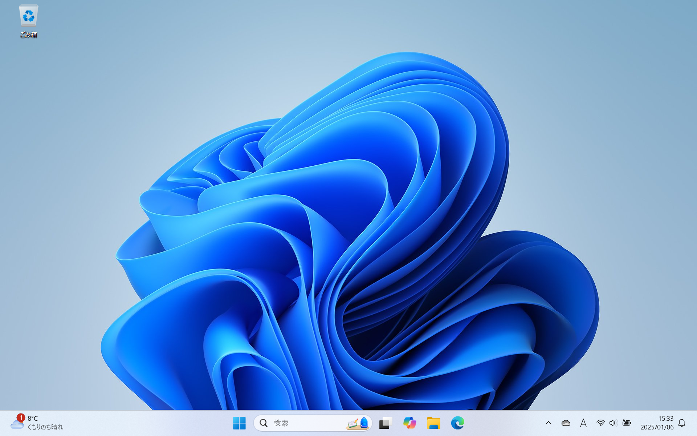
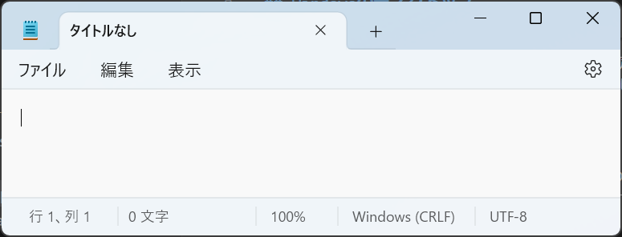

# Windowsの基本操作

Windowsでは、マウスなどのポインティングデバイスを使って、画面を操作することで、コンピューターへ指示を出すことができます。このような操作体系を**グラフィカル・ユーザー・インターフェース**（Graphical User Interface）と呼びます。

GUIは、コンピューターの操作を視覚的に表現することで、ユーザーが直感的に操作できるようにするためのものです。ここでは、GUIを通じて、Windowsのパーソナルコンピュータ（パソコン、PC）を使うための基本的な操作を学びます。

## Windowsのデスクトップ

Windowsのパソコンにログインすると、最初に表示される画面が**デスクトップ**（desktop）です。

デスクトップには、以下の要素が表示されます。

- **アイコン**（icon）: ファイルやフォルダ、アプリケーションなどを表す図形。
- **タスクバー**（taskbar）: 画面下部に表示されるバー。

アイコンをダブルクリックすると、そのアイコンに関連するファイルやアプリケーションが起動します。

デスクトップの最下部には、タスクバーが表示されます。タスクバーには、ウィジェット、スタート、検索ボックス、通知とクイック設定が表示されます。

### タスクバー

タスクバー左側には、**ウィジェット**（Widget）が表示されます。ウィジェットは、天気予報やニュースなどの情報を表示します。

**スタート**（Start）ボタンをクリックすると、スタートメニューが表示されます。さらに、「すべて」をクリックすると、アプリケーションの一覧が表示されます。スタートメニューには、よく使うアプリやフォルダをピン留めすることができます。**検索ボックス**（Search Box）にキーワードを入力すると、そのキーワードに関連するアプリなどが表示されます。スタートボタンと検索ボックスを使って、ほとんどのアプリケーションを起動することができます。

**通知とクイック設定**（notification and quick settings）はタスクバーの右側に表示されますクイック設定には、Wi-Fi、Bluetooth、画面の明るさなどの設定があります。

タスクバーを右クリックし、「タスクバーの設定」をクリックすると、タスクバーの設定を変更できます。例えば、ウィジェットを非表示にしたり、タスクバーの配置を変更したりすることができます。

## ウィンドウ

ウィンドウ（window）とは、コンピューターのGUIにおいて，情報を表示する領域のことです。一般的に、ウィンドウは、矩形の領域で、タイトルバー、メニューなどあります。ユーザーは、マウスやキーボードを使って、ウィンドウを操作することができます。

**タイトルバー**（title bar）は、ウィンドウの上部に表示されるバーです。アプリを識別し、ウィンドウを移動し、最小化、最大化、閉じるなどの操作を行うことができます。

- **最小化**（Minimize）: ウィンドウは消しますが、タスクバーのアイコンをクリックすると、ウィンドウが復元します。
- **最大化**（Maximize）: ウィンドウを画面いっぱいに表示します。
- **閉じる**（Close）: ウィンドウを閉じます。

アプリによっては、ウィンドウのデザインが異なります。例えば、メモ帳のウィンドウは以下のようになります。

## 電源の操作

Windowsのパソコンは、スタートメニューから電源の操作を行うことができます。

スタートメニューから電源ボタンをクリックすると、電源の操作が表示されます。電源の操作には、ロック、スリープ、シャットダウン、再起動の四つの操作があります。

- **ロック**（Lock）: ロック画面に切り替えます。ロックすると、サインインしないとパソコンを使用できません。一時的にパソコンを離れるときに使います。
- **スリープ**（Sleep）: パソコンをスリープ状態にします。スリープ状態では、パソコンは電源は入っていますが、低電力状態になります。パソコンを短時間使用しないときに使います。 ほとんどのPCでは、PCの電源ボタンを押す、任意のキーを押す、またはマウスを動かすことでスリープ状態から復帰できます。
- **シャットダウン**（Shut down）: シャットダウンすると、すべてのアプリを終了し、パソコンの電源を切ります。
- **再起動**（Restart）: すべてのアプリを終了し、パソコンの電源を切り、もう一度起動します。

## ショートカットキー

**ショートカット**（shortcut）は、マウスを使わずに、キーボードのキーまたはキーの組み合わせで、特定の機能を実行する方法です。ショートカットを使うと、作業効率が向上します。

|          ショートカット           | 説明                       |
| :-------------------------------: | :------------------------- |
|        <kbd>Windows</kbd>         | スタートメニューを開く     |
| <kbd>Windows</kbd> + <kbd>S</kbd> | 検索ボックス               |
| <kbd>Windows</kbd> + <kbd>L</kbd> | ロック                     |
| <kbd>Windows</kbd> + <kbd>M</kbd> | すべてのウィンドウを最小化 |
|  <kbd>Alt</kbd> + <kbd>Tab</kbd>  | ウィンドウの切り替え       |

## 練習

1. ウィジェットを非表示にしてみよう。
2. スタートメニューから「電卓」を起動してみよう。
3. 検索ボックスから「メモ帳」を検索し、起動してみよう。
4. メモ帳のウィンドウを最大化、最小化してみよう。
5. ショートカットキーを使って、PCの操作をしてみよう。