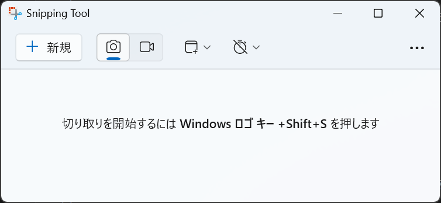

# スクリーンショット

**Snipping Tool**はWindowsに標準で付属しているツールです。ここでは、Snipping Toolを使ってスクリーンショットを撮る方法を説明します。

## Snipping Tool の起動

Snipping Toolを起動するには、検索ボックスに「Snipping Tool」と入力して、アプリを起動します。

:::{figure-md} open

Snipping Toolの基本操作画面
:::

## 切り取りモード

切り取りモードを選択します。以下の4つのモードがあります。

- 四角形
- ウィンドウ
- 全画面表示
- フリーフォーム

:::{figure-md} mode

切り取りモードの選択
:::

## 遅延切り取り

遅延切り取りを選択すると、切り取りを行うまでの時間を設定できます。

:::{figure-md} delay

遅延切り取りの設定
:::

## スクリーンショットの撮影

必要に応じて、切り取りモードや遅延切り取りを設定して、**+新規**をクリックしてスクリーンショを撮ります。

例えば、エクスプローラーのウインドウを撮る場合は、以下のように設定します。
1. 切り取りモードを「ウインドウ」に設定します。
2. 遅延切り取りを「待ち時間なし」に設定します。
3. **+新規**をクリックします。
4. エクスプローラーのウインドウを開きます。
5. ウインドウをクリックします。

:::{figure-md} example

エクスプローラーのウインドウの選択
:::

## 保存

撮ったスクリーンショットは自動的に保存されます。
Snipping Toolの画面で「…」をクリックして、「スクリーンショット　フォルダーを開く」を選択すると、保存されたスクリーンショットを確認できます。

:::{figure-md} save

スクリーンショットのフォルダーを開く
:::

## ショートカット

スクリーンショットを撮る際には、以下のショートカットキーを使うと便利です。

| ショートカットキー                               | 説明                                   |
| ------------------------------------------------ | -------------------------------------- |
| <kbd>Win</kbd> + <kbd>Shift</kbd> + <kbd>S</kbd> | 指定した範囲のスクリーンショットを撮る |
| <kbd>Win</kbd> + <kbd>PerSc</kbd>                | 全画面のスクリーンショットを撮る       |

## 練習

1. デスクトップのスクリーンショットを撮ってみよう。
2. エクスプローラーのウインドウのスクリーンショットを撮ってみよう。
3. 保存したスクリーンショットを確認してみよう。