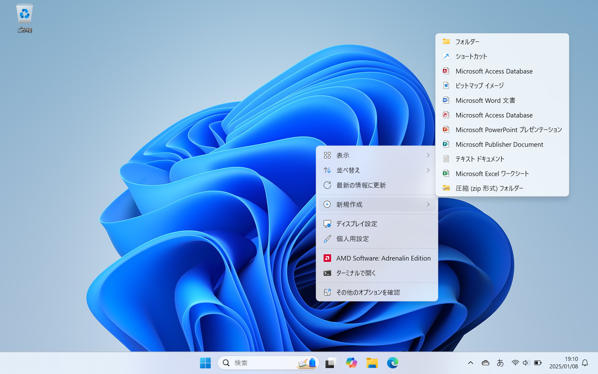
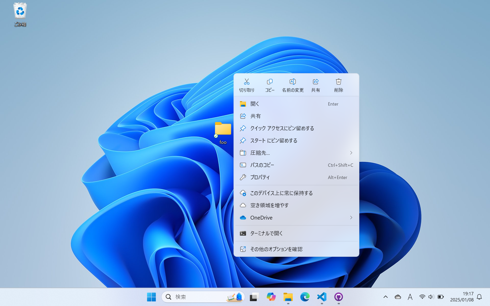
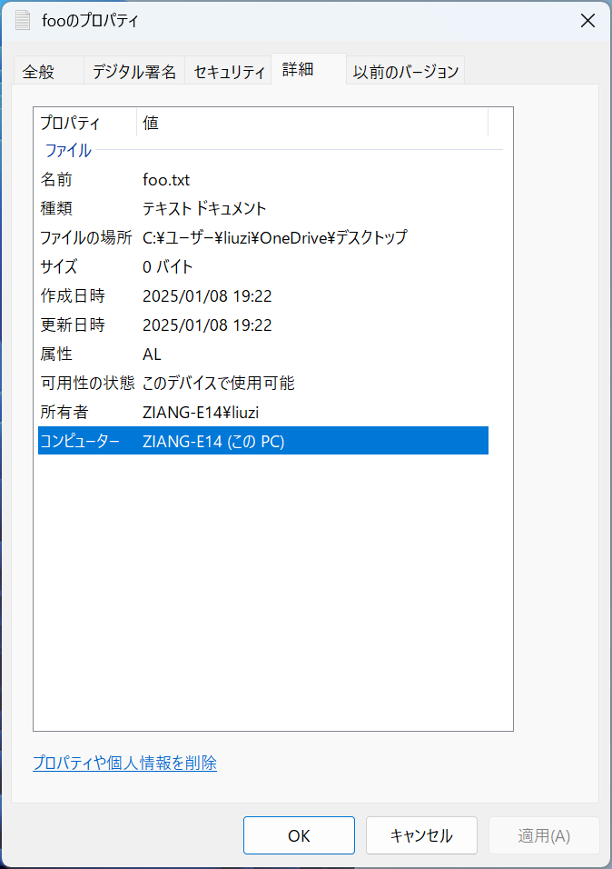

# ファイルとフォルダー

**ファイル**(file) とは、ある記録媒体に記録したデータの集まりのことです。用途によって、テキストファイル、画像ファイル、音声ファイル、動画ファイルなどがあります。ファイルを識別するためには、データにファイル名が付けられます。

**フォルダー**(folder) とは、ファイルを整理して保存するための場所です。フォルダーには、ファイルや他のフォルダーを保存することができます。

## ファイルとフォルダーの作成

デスクトップで右クリックして「新規作成」を選択すると、ファイルやフォルダーを作成することができます。フォルダーを作成する場合は、「フォルダー」を選択します。次に、フォルダーの名前を入力して、<kbd>Enter</kbd> キーを押すと、フォルダーが作成されます。

:::{figure-md} new


新規作成のメニュー
:::

下の図は、「foo」という名前のフォルダーを作成した例です。このフォルダーを右クリックすると、切り取り、コピー、削除、名前の変更、開くなどの操作を行うことができます。

:::{figure-md} foo


フォルダーの基本操作
:::

ファイルの新規作成も同様に行うことができます。ここでは、右クリックして「新規作成」を選択し、「テキストドキュメント」を選択します。次に、「foo」という名前を入力して、<kbd>Enter</kbd> キーを押すと、`foo.txt` という名前のテキストファイルが作成されます。このファイル名を確認するために、先ほど作成したテキストファイルを右クリックして「プロパティ」を選択し、「詳細」タブをクリックすると、ファイルの名前、種類、場所、サイズ、作成日時、更新日時などの情報が表示されます。

:::{figure-md} foo_txt


ファイルのプロパティ
:::

この図を見ると、ファイルの名前が `foo.txt` で、ファイルの種類が `テキスト ドキュメント` であることがわかります。`.txt`は、テキストファイルの拡張子です。

## 拡張子

**拡張子**（file name extension）は、ファイルの種類を識別するための文字列です。Windowsでは、ファイル名にはベースファイル名と拡張子が含まれています。ベースファイル名はファイルの内容を表す名前で、拡張子はファイルの種類を示す名前です。ピリオド（.）でファイル名と拡張子が区切られています。`.txt`以外にも、`.docx`（Microsoft Word）、`.pdf`（Adobe PDF）、`.jpg`（JPEG画像）など、様々な拡張子があります。

## 階層構造
Windowsのパソコンでは、ファイルやフォルダーを階層構造で管理されています。 例えば、`C:\Users\taro\Documents\foo.txt` というパスは、`C:` ドライブの `Users` フォルダーの `taro` フォルダーの `Documents` フォルダーにある `foo.txt` というファイルを示しています。日本語のWindowsでは、「\」の代わりに「¥」が使われています。日本語のWindowsでは、パスは次のように表示されます。`C:¥Users¥taro¥Documents¥foo.txt`。

::::{Note}
「\」はバックスラッシュ（backslash）、「¥」は円マーク（yen mark）と呼ばれます。日本語のOS環境ではバックスラッシュが円記号として表示されることが多いです。プログラミングでは、よく使われる記号なので覚えておきましょう。
::::

下記の例では、「courses」というフォルダーに「c_programming」というフォルダーがあり、その中に「code」と「slides」というフォルダーと「syllabus.pdf」というファイルがある構造を示しています。

```
courses
├── c_programming
│   ├── code
│   │   ├── hello.c
│   ├── slides
│   │   ├── lesson_1.pptx
│   ├── syllabus.pdf
hobbies
├── books
│   ├── how_to_read_a_book.pdf
```

## 圧縮と解凍

圧縮とは、コンピューターのデータをアルゴリズムを使って変換し、サイズを小さくすることです。解凍とは、アルゴリズムを使って変換し、圧縮されたデータをもとに戻すことです。サイズの大きなファイルを圧縮することで、データの転送や保存に便利です。

Windowsでは、ファイルやフォルダーを右クリックして「圧縮先...」を選択し、「ZIPファイル」を選択すると、ファイルやフォルダーを圧縮することができます。また、圧縮したファイルを右クリックして「すべて展開...」を選択すると、ファイルを解凍することができます。

## 練習

1. デスクトップに「計算機実習」という名前のフォルダーを作成してみよう。
2. 「計算機実習」フォルダー内に「課題1」という名前のフォルダーと「task1.txt」という名前のテキストファイルを作成してみよう。
3. 「計算機実習」フォルダーを圧縮して、解凍してみよう。