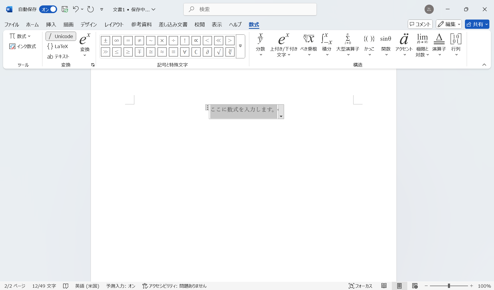
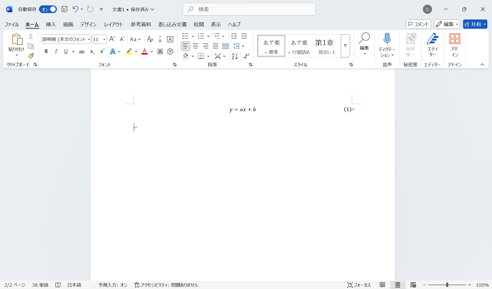
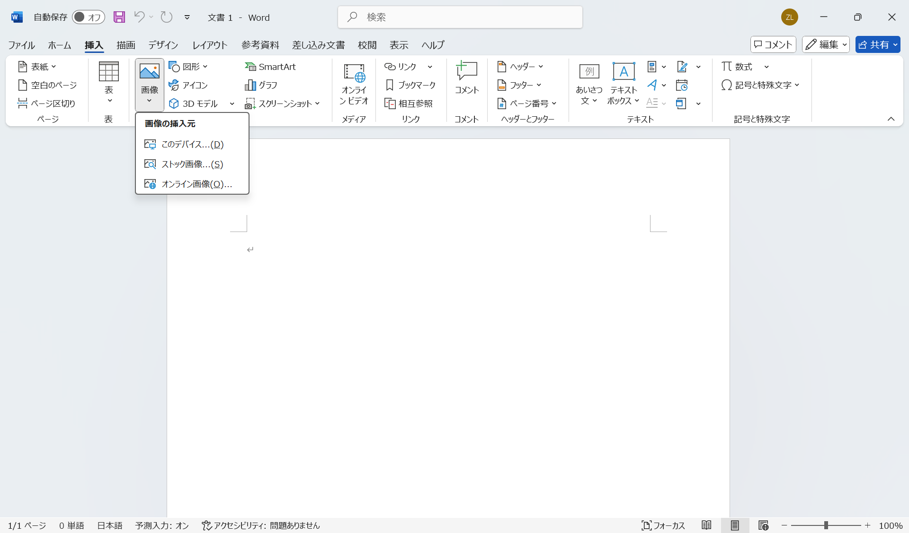

# 文書の編集

## 文字入力

ワードに日本語の文字を入力するには、メモ帳などと同様に、日本語IMEを利用します。

ここでは、ワードの「貼り付け」機能について、説明します。ウェブページなどからテキストをコピーして、ワードの文書に貼り付ける方法を紹介します。以下のテキストは、Wikipediaの「[Microsoft Word](https://ja.wikipedia.org/wiki/Microsoft_Word)」のページにある文章です。テキストだけでなく、太字やリンクも含まれています。

---
**Microsoft Word**（マイクロソフト ワード）は、
[マイクロソフト](https://ja.wikipedia.org/wiki/%E3%83%9E%E3%82%A4%E3%82%AF%E3%83%AD%E3%82%BD%E3%83%95%E3%83%88)
がWindows、Android、macOSおよびiOS向けに販売している
[文書作成ソフトウェア](https://ja.wikipedia.org/wiki/%E3%83%AF%E3%83%BC%E3%83%97%E3%83%AD%E3%82%BD%E3%83%95%E3%83%88)。

---

この内容を以下の手順でワードの文書に貼り付けてみましょう。

1. マウスで、上記のテキストを選択し、右クリックして「コピー」を選択します。
2. ワードの文書に移動し、適当な位置で右クリックします。
3. 「貼り付けのオプション」では、「元の書式を保持」、「書式を結合」、「テキストのみ保持」の三つのオプションが表示されます。それぞれのオプションを選択して、その違いを確認してみましょう。

「元の書式を保持」、「書式を結合」、「テキストのみ保持」の違いについて説明します。

- **元の書式を保持**：コピー元の書式をそのまま保持して貼り付けます。
- **書式を結合**：コピー元の書式と、ワードの書式を結合して貼り付けます。
- **テキストのみ保持**：テキストのみを貼り付けます。

文書の書式が崩れないように、一般的には「テキストのみ保持」を選択します。

## 数式の入力

まずは、数式を入力する前に、**半角モード**に切り替えていることを確認しましょう。

数式を入力するには、「挿入」タブの「記号と特殊文字」グループから、「数式」を選択します。すると、「数式」タブが表示されます。

「数式」タブには「ツール」、「変換」、「記号と特殊文字」、「構造」のグループがあります。「記号と特殊文字」と「構造」グループを用いて、直感的に数式を入力することができます。

また、「変換」モードが「Unicode」になっています。これは、数式を入力する際に、**UnicodeMath**形式で入力することを意味します。他には「LaTex」がありますが、ここではデフォルトの「Unicode」について説明します。

:::{note}
$\TeX$（テフ）は、文書整形プログラムの一つです。$\TeX$にマクロパッケージを追加したものが$\LaTeX$（ラテフ）です。
理系の学術論文や書籍を作成するために、$\LaTeX$が広く利用されています。
:::

### UnicodeMath形式

ここでは、例を使って、UnicodeMath形式で数式を入力する方法を説明します。日本語システムでは、「\」を「￥」キーで入力します。「a^2 <kbd>Space</kbd>」は、a^2 を入力し、<kbd>Space</kbd>キーを押すことを意味します。以下の表を参考に、数式を入力してみましょう。

|            UnicodeMath             |          表示           | 説明   |
| :--------------------------------: | :---------------------: | :----- |
|        a^2 <kbd>Space</kbd>        |          $a^2$          | 二乗和 |
|        x_1 <kbd>Space</kbd>        |          $x_1$          | 添字   |
|     \sqrt(a) <kbd>Space</kbd>      |       $\sqrt{a}$        | 平方根 |
|      a/(b+c) <kbd>Space</kbd>      |     $\frac{a}{b+c}$     | 分数   |
|      (a+b/c) <kbd>Space</kbd>      |    $(a+\frac{b}{c})$    | 括弧   |
|      {a+b/c} <kbd>Space</kbd>      |   $\{a+\frac{b}{c}\}$   | 波括弧 |
|   \overbar(abc) <kbd>Space</kbd>   |    $\overline{abc}$     | 上線   |
| lim_(n->\infty) <kbd>Space</kbd> n | $\lim_{n \to \infty} n$ | 極限   |
|  \sum_(i=1)^n <kbd>Space</kbd> i   |    $\sum_{i=1}^n i$     | 総和   |
|       sin <kbd>Space</kbd> x       |        $\sin x$         | 正弦   |
|       cos <kbd>Space</kbd> x       |        $\cos x$         | 余弦   |
|       tan <kbd>Space</kbd> x       |        $\tan x$         | 正接   |
|      \alpha <kbd>Space</kbd>       |        $\alpha$         | Alpha  |
|       \beta <kbd>Space</kbd>       |         $\beta$         | Beta   |

### 式番号

式番号をつけるには、入力した数式の最後に`#(番号)`と入力して、<kbd>Enter</kbd>キーを押します。

例えば、`y=ax+b#(1)`と入力し、<kbd>Enter</kbd>キーを押すと、式番号`(1)`が付与されます。

## 画像の挿入

画像を挿入するには、「挿入」タブの「図」グループから、「画像」を選択します。すると、「画像の挿入元」が表示されます。

- **このデバイス...**：PC内の画像ファイルを選択して挿入します。
- **ストック画像...**：Microsoftの提供する画像を選択して挿入します。アイコン、マンガ、イラストなどがあります。
- **オンライン画像...**：インターネット上の画像を挿入します。

ここでは、「このデバイス...」を使って、以下の画像を挿入してみます。まず、この画像を右クリックして、「名前を付けて画像を保存」で、PC内に保存します。デフォルトでは、画像は「ダウンロード」フォルダに「example.png」という名前で保存されます。

