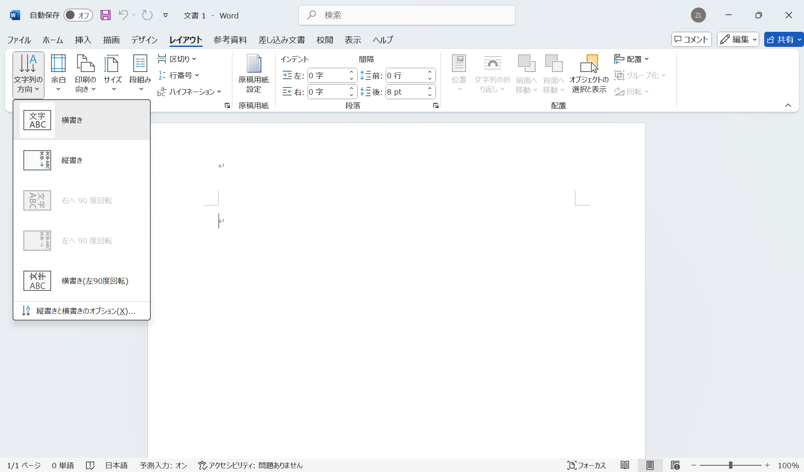
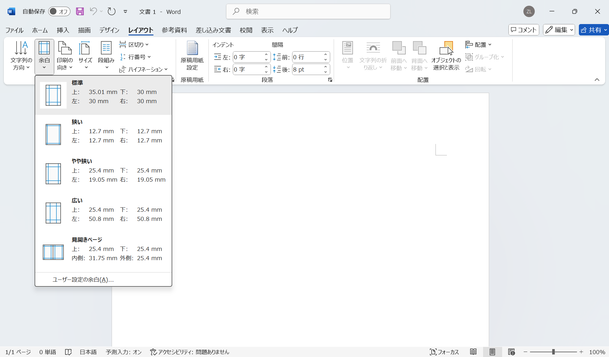
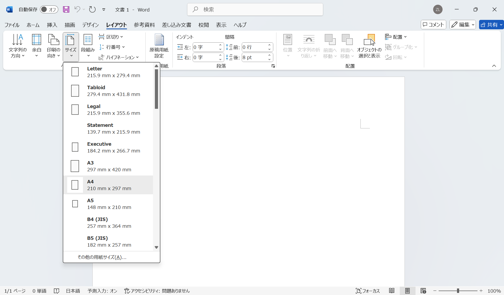
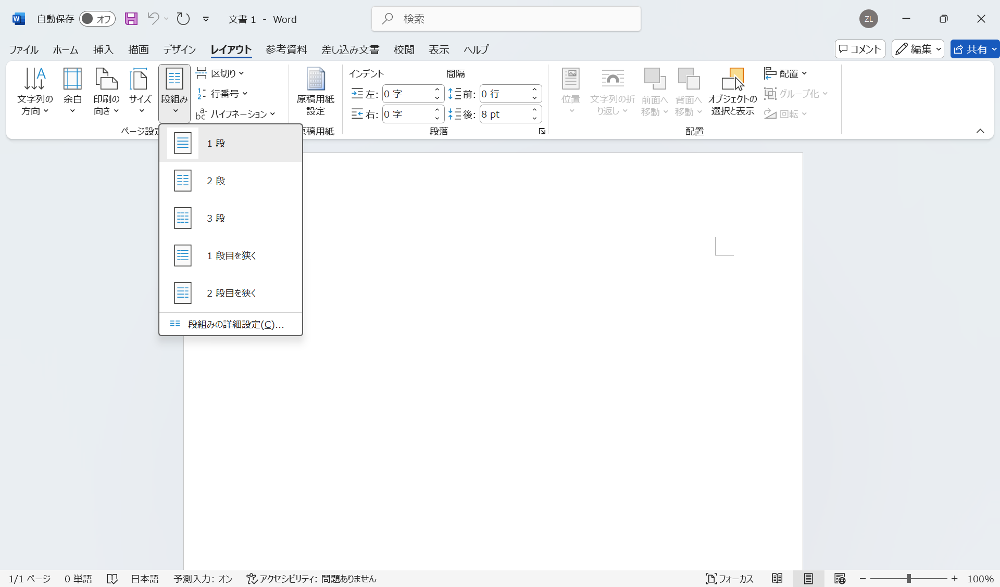
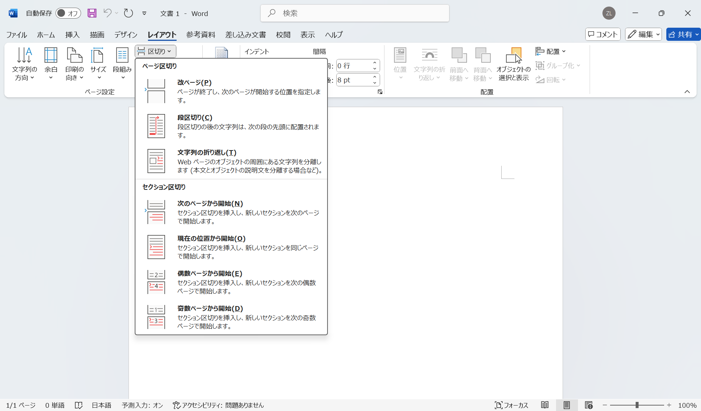

# Wordによる文書作成

**Microsoft Word**は、コンピューターを用いて、文書を作成、編集、印刷するためのソフトウェアです。一般的に、**ワード**（Word）と呼ばれます。ここでは、Wordの基本的な使い方を紹介します。

:::{note}
**テキストファイル**（Text File）とは、ASCIIやUnicodeなどの文字コードでによって、文字データだけで構成されたファイルです。テキストファイルを編集するためのソフトウェアは、**テキストエディタ**（Text Editor）と呼ばれます。

Wordのような**ワードプロセッサ**（Word Processor）は、文字の修飾、表の作成、画像の挿入などの機能が追加されています。

テキストエディタとワードプロセッサのどちらも、テキストを入力、編集、保存することができますが、テキストファイルは文字データだけで構成されているのに対して、Wordで作成されたファイルは、文字データ以外にも、書式や画像などの情報が含まれています。
:::

一般的なWordによる文書作成の手順は以下の通りです。

1. 新規Word文書の作成
2. レイアウトの設定
3. スタイルの設定
4. 文書の編集
5. 文書の保存・印刷

## 新規Word文書の作成

新規Word文書を作成するには、検索ボックスに「Word」と入力して、Wordを選択します。Wordを起動したら、次のような画面が表示されます。ここには、「白紙の文書」、「カレンダー」などのテンプレートが用意されています。その下にある「その他のテンプレート」を選択すると、「請求書」、「賞状」などさらに多くのテンプレートが用意されています。

一般的な文書を作成する場合は、「白紙の文書」を選択します。ここでは、「白紙の文書」を選択して、新規Word文書を作成します。

### Wordの画面構成

Wordの画面は、以下のように構成されています。下の図では、Wordの起動画面で「白紙の文書」を選択した後の画面を示しています。

- クイックアクセスツールバー（Quick Access Toolbar）：よく使う機能のアイコンが表示されている
- リボン（Ribbon）
  - タブ（Tab）：ファイル、ホーム、描画、デザイン、レイアウト、参考資料、差し込み文書、校閲、表示、ヘルプ
  - コマンド（Command）：タブに属するコマンド。ホームタブには、フォント、段落、スタイル、編集、検索、表示などのコマンドのグループがある
- ドキュメントエリア（Document Area）：文書の編集エリア
- スクロールバー（Scrollbar）：ドキュメントエリアのスクロール
- ステータスバー（Status Bar）：ページ数、単語数などの情報
- ズームスライダー（Zoom Slider）：「＋」、「－」でズームイン、ズームアウト

## レイアウトの設定

文字列の方向、用紙のサイズ、余白の設定などの文書レイアウトを設定するには「レイアウト」タブを選択します。

文字列の方向を変更するには、「レイアウト」タブから「ページ設定」グループにある「文字列の方向」を選択します。以下の図のように、「縦」、「横」が選択できます。

「余白」を選択すると、以下の図のように余白の設定ができます。「標準」、「狭い」、「広い」などの既定の余白設定が用意されています。また、「ユーザー設定の余白」を選択すると、上下左右の余白を自由に設定できます。

「サイズ」を選択すると、以下の図のように用紙サイズの設定ができます。「A4」、「B5」、「A3」などの既定の用紙サイズが用意されています。

段組みとはページを複数の列に分けて文字をレイアウトすることです。「段組み」から「1段」、「2段」、「3段」などの段組みの設定ができます。通常は「1段」を選択しますが、新聞、雑誌などのように複数の段組みが必要な場合は、段組みの設定を変更します。

<!-- 「区切り」には「ページ区切り」と「セクション区切り」があります。Wordでは、セクションごとにヘッダー、フッター、ページ番号、段組みの設定などを設定することができます。

 -->

## スタイルの設定

「ホーム」タブの「フォント」グループや「段落」グループから、文字と段落の修飾を設定することができますが、より効率的に、一貫性のある文書を作成するためには、スタイルを使用することが重要です。スタイルを使用すると、以下のようなメリットがあります。

- 文書全体の一貫性を保つことができる
- 文書の修飾を簡単に変更できる
- 目次、索引などの自動生成が可能

