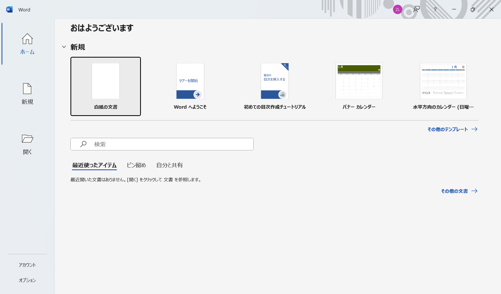
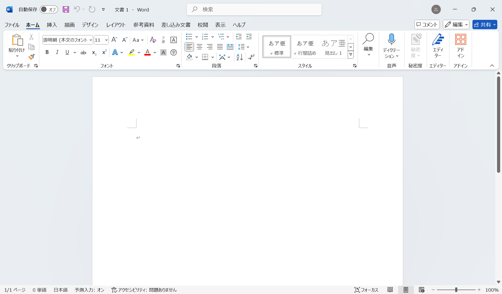

# 新規Word文書の作成

新規Word文書を作成するには、検索ボックスに「Word」と入力して、Wordを選択します。Wordを起動したら、次のような画面が表示されます。ここには、「白紙の文書」、「カレンダー」などのテンプレートが用意されています。その下にある「その他のテンプレート」を選択すると、「請求書」、「賞状」などさらに多くのテンプレートが用意されています。

一般的な文書を作成する場合は、「白紙の文書」を選択します。ここでは、「白紙の文書」を選択して、新規Word文書を作成します。

## Wordの画面構成

Wordの画面は、以下のように構成されています。下の図では、Wordの起動画面で「白紙の文書」を選択した後の画面を示しています。

- クイックアクセスツールバー（Quick Access Toolbar）：よく使う機能のアイコンが表示されている
- リボン（Ribbon）
  - タブ（Tab）：ファイル、ホーム、描画、デザイン、レイアウト、参考資料、差し込み文書、校閲、表示、ヘルプ
  - コマンド（Command）：タブに属するコマンド。ホームタブには、フォント、段落、スタイル、編集、検索、表示などのコマンドのグループがある
- ドキュメントエリア（Document Area）：文書の編集エリア
- スクロールバー（Scrollbar）：ドキュメントエリアのスクロール
- ステータスバー（Status Bar）：ページ数、単語数などの情報
- ズームスライダー（Zoom Slider）：「＋」、「－」でズームイン、ズームアウト