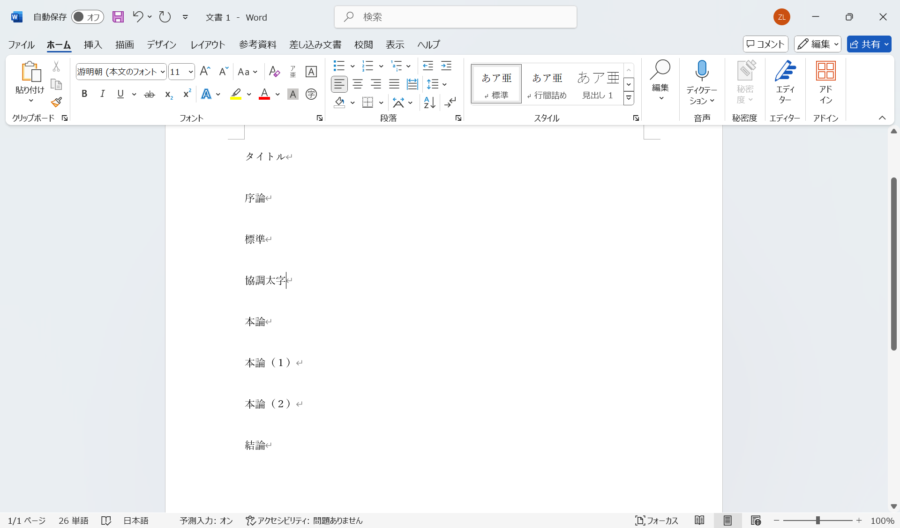
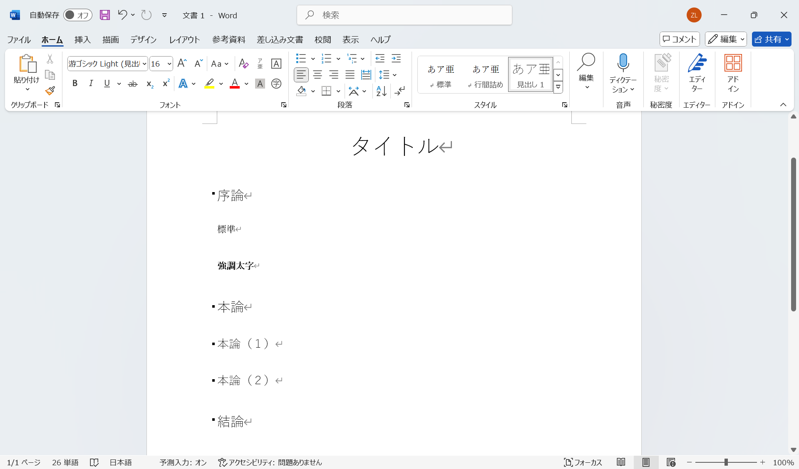

# スタイルの設定

「ホーム」タブの「フォント」グループや「段落」グループから、文字と段落の修飾を設定することができますが、より効率的に、一貫性のある文書を作成するためには、スタイルを使用することが重要です。スタイルを使用すると、以下のようなメリットがあります。

- 文書全体の一貫性を保つことができる
- 文書の修飾を簡単に変更できる
- 目次、索引などの自動生成が可能

特に、論文などの長い文書を作成する場合は、スタイルを先に設定しておくと、後で修飾を変更する際に便利です。

## スタイルの適用

以下の図のように、「ホーム」タブの「スタイル」グループには、「標準」、「見出し1」、「表題」、「引用」などのスタイルが用意されています。


ここから、スタイルの適用方法を説明しますので、以下の内容をワードに入力します。

```
タイトル
序論
本論
標準
強調太字
本論（１）
本論（２）
結論
```

上記の内容を入力すると、以下のようになります。「スタイル」グループを確認すると、「標準」が選択されていることがわかります。これは、デフォルトで入力される文字列に適用されるスタイルです。




それぞれのテキストを選択して、スタイルを適用します。
タイトルには「表題」、
序論、本論、結論には「見出し1」、
標準には「標準」、
強調太字には「強調太字」、
本論（１）、本論（２）には「見出し2」を適用します。

下の図では、スタイルが適用された画面を示しています。見出し１と見出し２のスタイルを適用すると、文字も前に点が付きます。この点は、ワードで見出しが適用されていることを示しています。印刷時には、この点は表示されません。



<kbb>Ctrl</kbb> + <kbb>F</kbb>を押すと、ナビゲーションペインが表示されます。ナビゲーションペインの「見出し」を選択すると、文書内の見出しの一覧が表示されます。また、「本論（１）」と「本論（２）」が「本論」に属して、階層構造になっていることがわかります。
ここから、文書内の見出しをクリックすると、その見出しに移動することができます。


## スタイルの変更

「見出し１」のスタイルを変更するには、スタイルの「見出し1」を右クリックして、「変更」を選択します。


「変更」を選択すると、「スタイルの変更」が表示されます。ここでは、フォントサイズを「14」に変更して、「**B**」を選択し、「OK」をクリックします。


「序論」、「本論」、「結論」の様式が自動的に変更されます。


## アウトラインの定義

見出しのスタイルを適用すると、見出しに番号を自動的に付けることができます。例えば、以下のように「序論」、「本論」、「結論」に「第１章」、「第２章」、「第３章」の番号を付けることができます。

```
第1章 序論
第2章 本論
第3章 結論
```

番号を自動的に付けるには、「アウトラインの定義」を設定します。以下の図のように、「ホーム」タブの「段落」グループから、「アウトラインの定義」を選択します。


「新しいアウトラインの定義」が表示されます。ここで、「オプション」を選択すると、詳細な設定ができます。


ここでは、「変更するレベルをクリックしてください：」から、「1」を選択します。そして、「レベルと対応つける見出しスタイル」を「見出し1」に設定します。デフォルトでは、「書式番号」が「1」に設定されていますが、ここでは、「第1章」に変更します。「1」の背景が灰色になっていますが、これは「第1章」、「第2章」、「第3章」という形式で番号が付けられることを示しています。設定し終わりましたら、「OK」をクリックして、文書に戻ります。


「序論」、「本論」、「結論」に「第１章」、「第２章」、「第３章」の番号が自動的に付けられます。


レベル「2」には、「レベルと対応つける見出しスタイル」を「見出し2」に設定します。デフォルトでは、「書式番号」が「1.1」に設定されています。


「本論（１）」、「本論（２）」が「第２章」に属していることで、「2.1」、「2.2」の番号が付けられます。

