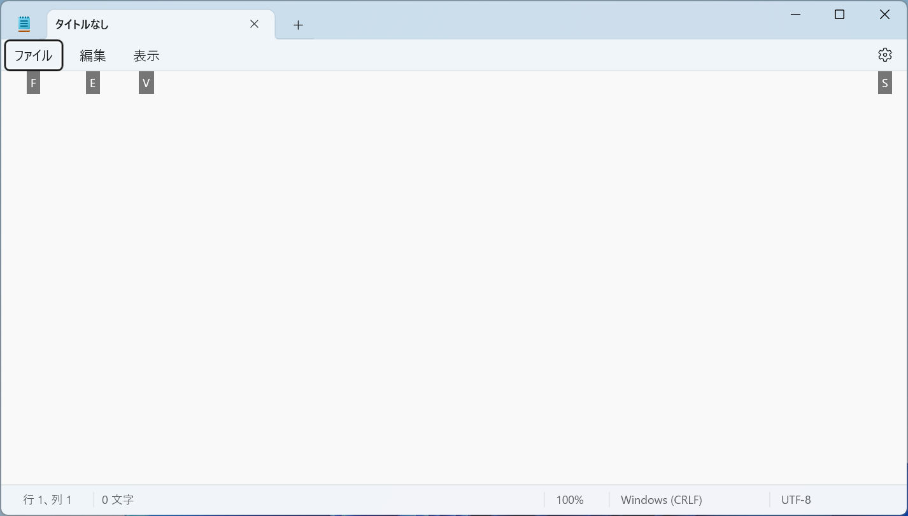

# キーボード

## 入力キー

入力キーには、文字、数字、句読点、記号に加えて、<kbd>Shift</kbd>、<kbd>CapsLock</kbd>、<kbd>Tab</kbd>、<kbd>Enter</kbd>、<kbd>Space</kbd>、<kbd>BackSpace</kbd> も含まれます。

### Shift
<kbd>Shift</kbd> キーを押しながら、アルファベットキーを押すと、大文字が入力されます。また、<kbd>Shift</kbd> キーを押しながら別のキーを押すと、そのキーの上部に記載されている記号が入力されます。

### CapsLock
すべての文字を大文字で入力するには、<kbd>Caps Lock</kbd> + <kbd>Shift</kbd>キーを押します。多くのキーボードでは、大文字モードになると、キーボードの<kbd>Caps Lock</kbd>キーのランプが点灯します。

### Tab
<kbd>Tab</kbd> キーは、カーソルを一定文字数分移動するキーです。

### Enter
<kbd>Enter</kbd> キーを押すと、カーソルが次の行に移動します。

### Space
<kbd>Space</kbd> キーは、カーソルを1文字分移動します。

### BackSpace
<kbd>BackSpace</kbd> キーを押すと、カーソルの前の文字を削除します。

## コントロールキー

よく使うコントロールキーとして、<kbd>Ctrl</kbd>、<kbd>Alt</kbd>、<kbd>Windows</kbd>、<kbd>Esc</kbd>があります。

### Ctrl

|         ショートカット         | 説明     | English |
| :----------------------------: | :------- | :------ |
| <kbd>Ctrl</kbd> + <kbd>S</kbd> | 保存     | Save    |
| <kbd>Ctrl</kbd> + <kbd>C</kbd> | コピー   | Copy    |
| <kbd>Ctrl</kbd> + <kbd>X</kbd> | 切り取り |         |
| <kbd>Ctrl</kbd> + <kbd>V</kbd> | 貼り付け |         |
| <kbd>Ctrl</kbd> + <kbd>Z</kbd> | 元に戻す |         |
| <kbd>Ctrl</kbd> + <kbd>A</kbd> | 全選択   | All     |
| <kbd>Ctrl</kbd> + <kbd>F</kbd> | 検索     | Find    |

 
### Alt

|         ショートカット          | 説明               |
| :-----------------------------: | :----------------- |
| <kbd>Alt</kbd> + <kbd>Tab</kbd> | ウィンドウ切り替え |

<kbd>Alt</kbd> キーのもう一つの使い方は、アクセスキーです。アクセスキーとは、<kbd>Alt</kbd> キーと特定のキーを同時に押すことで、キーボードでアプリを操作する機能です。MS Office、メモ帳などのアプリケーションでは、アクセスキーが使用されています。

メモ帳で<kbd>Alt</kbd>キーを押すと、使用可能なアクセスキーのヒントが表示されます。<kbd>Alt</kbd>とそれを同時に押すと、その機能が実行されます。

- <kbd>Alt</kbd> + <kbd>F</kbd>：ファイル
- <kbd>Alt</kbd> + <kbd>E</kbd>：編集
- <kbd>Alt</kbd> + <kbd>V</kbd>：表示
- <kbd>Alt</kbd> + <kbd>S</kbd>：設定

### Windows

<kbd>Windows</kbd>キー（以下、<kbd>Win</kbd>キー）は、キーボードの左下にあるWindowsロゴのキーです。<kbd>Win</kbd>キーを押すと、スタートメニューが表示されます。

<kbd>Win</kbd>キーと他のキーを組み合わせると、Windowsのショートカットが使用できます。

|          ショートカット          | 説明                 |
| :------------------------------: | :------------------- |
|  <kbd>Win</kbd> + <kbd>W</kbd>   | ウィジェットを開く   |
|  <kbd>Win</kbd> + <kbd>E</kbd>   | エクスプローラを開く |
| <kbd>Win</kbd> + <kbd>Tabs</kbd> | タスクビューを開く   |
|  <kbd>Win</kbd> + <kbd>D</kbd>   | デスクトップを表示   |

### Esc

<kbd>Esc</kbd>キーは現在の操作をキャンセルするために使用します。

## タイピング

<!-- ## タイピングの練習

https://manabi.benesse.ne.jp/gakushu/typing/ -->

<!-- ## タッチタイピング -->

### ローマ字入力

|       |  あ   |    い    |    う    |  え   |  お   |    や     |    ゆ     |    よ     |
| :---: | :---: | :------: | :------: | :---: | :---: | :-------: | :-------: | :-------: |
|  あ   |  あ   |    い    |    う    |  え   |  お   |           |           |           |
|       |   a   |    i     |    u     |   e   |   o   |           |           |           |
|  か   |  か   |    き    |    く    |  け   |  こ   |   きゃ    |   きゅ    |   きょ    |
|       |  ka   |    ki    |    ku    |  ke   |  ko   |    kya    |    kyu    |    kyo    |
|  さ   |  さ   |    し    |    す    |  せ   |  そ   |   しゃ    |   しゅ    |   しょ    |
|       |  sa   | si (shi) |    su    |  se   |  so   | sya (sha) | syu (shu) | syo (sho) |
|  た   |  た   |    ち    |    つ    |  て   |  と   |   ちゃ    |   ちゅ    |   ちょ    |
|       |  ta   | ti (chi) | tu (tsu) |  te   |  to   | tya (cha) | tyu (chu) | tyo (cho) |
|  な   |  な   |    に    |    ぬ    |  ね   |  の   |   にゃ    |   にゅ    |   にょ    |
|       |  na   |    ni    |    nu    |  ne   |  no   |    nya    |    nyu    |    nyo    |
|  は   |  は   |    ひ    |    ふ    |  へ   |  ほ   |   ひゃ    |   ひゅ    |   ひょ    |
|       |  ha   |    hi    | hu (fu)  |  he   |  ho   |    hya    |    hyu    |    hyo    |
|  ま   |  ま   |    み    |    む    |  め   |  も   |   みゃ    |   みゅ    |   みょ    |
|       |  ma   |    mi    |    mu    |  me   |  mo   |    mya    |    myu    |    myo    |
|  や   |  や   |          |    ゆ    |       |  よ   |           |           |           |
|       |  ya   |          |    yu    |       |  yo   |           |           |           |
|  ら   |  ら   |    り    |    る    |  れ   |  ろ   |   りゃ    |   りゅ    |   りょ    |
|       |  ra   |    ri    |    ru    |  re   |  ro   |    rya    |    ryu    |    ryo    |
|  わ   |  わ   |          |          |       |  を   |           |           |           |
|       |  wa   |          |          |       |  wo   |           |           |           |
|  ん   |  ん   |          |          |       |       |           |           |           |
|       |  nn   |          |          |       |       |           |           |           |
|  が   |  が   |    ぎ    |    ぐ    |  げ   |  ご   |   ぎゃ    |   ぎゅ    |   ぎょ    |
|       |  ga   |    gi    |    gu    |  ge   |  go   |    gya    |    gyu    |    gyo    |
|  ざ   |  ざ   |    じ    |    ず    |  ぜ   |  ぞ   |   じゃ    |   じゅ    |   じょ    |
|       |  za   | zi (ji)  |    zu    |  ze   |  zo   | zya (ja)  | zyu (ju)  | zyo (jo)  |
|  だ   |  だ   |    ぢ    |    づ    |  で   |  ど   |   ぢゃ    |   ぢゅ    |   ぢょ    |
|       |  da   |    di    |    du    |  de   |  do   |    dya    |    dyu    |    dyo    |
|  ば   |  ば   |    び    |    ぶ    |  べ   |  ぼ   |   びゃ    |   びゅ    |   びょ    |
|       |  ba   |    bi    |    bu    |  be   |  bo   |    bya    |    byu    |    byo    |
|  ぱ   |  ぱ   |    ぴ    |    ぷ    |  ぺ   |  ぽ   |   ぴゃ    |   ぴゅ    |   ぴょ    |
|       |  pa   |    pi    |    pu    |  pe   |  po   |    pya    |    pyu    |    pyo    |

#### 小さい文字

小さい文字は、LまたはXを前につけて入力します。

|  ぁ   |  ぃ   |  ぅ   |  ぇ   |  ぉ   |  ゃ   |  ゅ   |  ょ   |  っ   |
| :---: | :---: | :---: | :---: | :---: | :---: | :---: | :---: | :---: |
|  la   |  li   |  lu   |  le   |  lo   |  lya  |  lyu  |  lyo  |  ltu  |
|  xa   |  xi   |  xu   |  xe   |  xo   |  xya  |  xyu  |  xyo  |  xtu  |

#### 促音

小さい「っ」の入力は、次の音の最初の文字を2回入力します。

**例：** 
- 学校（がっこう）：gakkou
- コップ：koppu