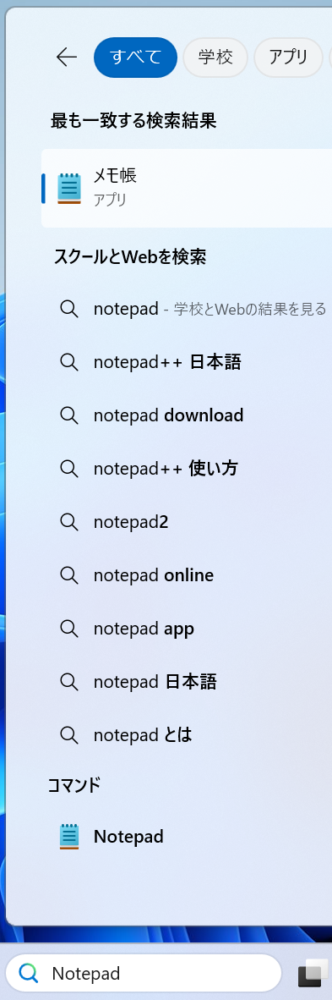
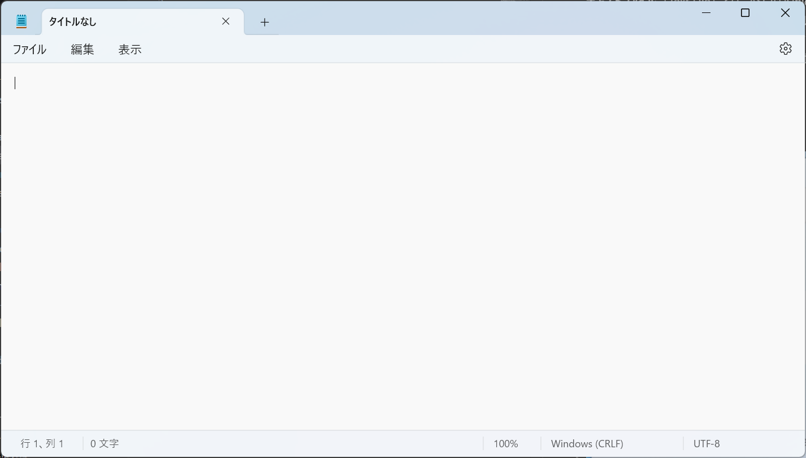

# メモ帳

**テキストファイル**（Text File）とは、ASCIIやUnicodeなどの文字コードでによって、文字データだけで構成されたファイルです。テキストファイルを編集するためのソフトウェアは、**テキストエディタ**（Text Editor）と呼ばれます。Microsoft Windowsに標準で付属しているテキストエディタは、**メモ帳**（Notepad）です。

メモ帳を起動するには、検索ボックスに「メモ帳」
や「Notepad」と入力して、メモ帳をクリックします。

<!--  -->

メモ帳の画面は以下のようになります。点滅している縦棒が、カーソルです。カーソルの位置に文字が入力されます。



## 設定
歯車のアイコン⚙️をクリックして、フォントや文字列の折り返しなどの設定を変更できます。デフォルトのフォントでは、ファミリは「MS ゴシック」、スタイルは「標準」、サイズは「11」です。

## 最初の文字列
メモ帳が起動したら、以下の文字列を入力してみましょう。

```
Hello, World!
こんにちは、世界！
```

## 保存
新しいファイルを保存するには、「ファイル」メニューから「名前を付けて保存」を選択します。「名前を付けて保存」の画面では、保存場所、ファイル名、ファイルの種類を設定できます。デフォルトのファイルの種類は、「テキスト ドキュメント (*.txt)」です。必要に応じて、保存場所とファイル名を設定して、「保存」ボタンをクリックします。

## 拡張子
例えば、ファイル名を「my_first_text」として、ファイルの種類を「テキスト ドキュメント (*.txt)」に設定して保存すると、ファイル名「my_first_text.txt」で保存されます。`.txt`は、テキストファイルの**拡張子**（Filename Extension）です。拡張子は、ファイルの種類を識別するための文字列です。`.txt`以外にも、`.docx`（Microsoft Word）、`.pdf`（Adobe PDF）、`.jpg`（JPEG画像）など、様々な拡張子があります。

## 名前を付けて保存と保存
「ファイル」メニューでは「名前を付けて保存」と「保存」の2つの保存方法があります。

**名前を付けて保存**は、新しい名称のファイルとして保存します。既存のファイルをを編集して名前を付けて保存すると、編集前のファイルは消さずに、新しいファイルとして保存されます。**保存**は、既に保存したファイルを上書き保存します。新しいファイルの場合は、名前を付けて保存と同じ動作になります。

ショートカット（Shortcut）はキーまたはキーの組み合わせで、特定の機能を実行するための方法です。保存のショートカットは、<kbd>Ctrl</kbd> + <kbd>S</kbd>です。


