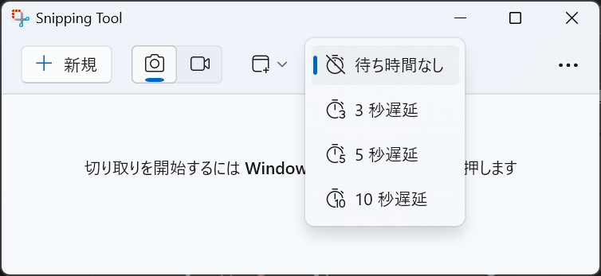

# スクリーンショット

**Snipping Tool**はWindowsに標準で付属しているツールです。ここでは、Snipping Toolを使ってスクリーンショットを撮る方法を説明します。

## Snipping Tool の起動

Snipping Toolを起動するには、検索ボックスに「Snipping Tool」と入力して、アプリを起動します。

## 切り取りモード

切り取りモードを選択します。以下の4つのモードがあります。

- 四角形
- ウィンドウ
- 全画面表示
- フリーフォーム

## 遅延切り取り

遅延切り取りを選択すると、切り取りを行うまでの時間を設定できます。

## スクリーンショットの撮影

必要に応じて、切り取りモードや遅延切り取りを設定して、**+新規**をクリックしてスクリーンショを撮ります。

例えば、エクスプローラーのウインドウを撮る場合は、以下のように設定します。
1. 切り取りモードを「ウインドウ」に設定します。
2. 遅延切り取りを「待ち時間なし」に設定します。
3. **+新規**をクリックします。
4. エクスプローラーのウインドウを開きます。
5. ウインドウをクリックします。

## 保存

スクリーンショットを撮りましたら、以下のような画面が表示されます。

撮ったスクリーンショットは自動的に保存されます。「…」をクリックして、「スクリーンショット　フォルダーを開く」を選択すると、保存されたスクリーンショットを確認できます。

## ショートカット

スクリーンショットを撮る際には、以下のショートカットキーを使うと便利です。

| ショートカットキー | 説明 |
| --- | --- |
| <kbd>Win</kbd> + <kbd>Shift</kbd> + <kbd>S</kbd> | 指定した範囲のスクリーンショットを撮る |
| <kbd>Win</kbd> + <kbd>PerSc</kbd> | 全画面のスクリーンショットを撮る |