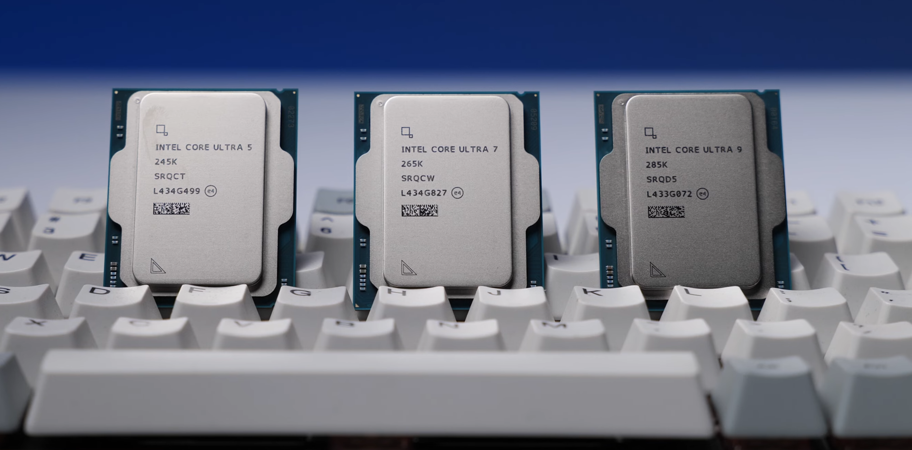

# コンピューターとは

**コンピューター**（computer）とは，電子回路を用い，指示された通り自動的にデータの貯蔵・検索・加工を行う装置で，**電子計算機**とも呼ばれる．**計算機**という言葉は，狭義では電子計算機を指すが，広義では計算を行う装置全般を指す．

コンピューターには，日常生活で使われるパーソナルコンピュータをはじめ，スーパーコンピューター，スマートフォン，タブレットなどがある．日本のスーパーコンピューター「富岳」は，兵庫県神戸市・ポートアイランドの理化学研究所計算科学研究センターに設置されている．

:::{figure-md} Fugaku

日本のスーパーコンピューター「富岳（ふがく）」 © [Barsaka2](https://commons.wikimedia.org/wiki/File:RIKEN_R-CCS_Fugaku.jpg), [CC BY-SA 3.0](https://creativecommons.org/licenses/by-sa/3.0/deed.en)
:::

**パーソナルコンピュータ**（パソコン，PC）は，個人が利用するために設計されたコンピューターである．パソコンは，**デスクトップパソコン**と**ノートパソコン**に分けられる．

## ハードウェアとソフトウェア

コンピューターは，**ハードウェア**（hardware）と**ソフトウェア**（software）から構成される．ここからは，ハードウェアとソフトウェアについて説明する．

### ハードウェア

ハードウェアとは，コンピューターを構成する物理的な装置である．現在のほとんどのコンピューターは，**ノイマン型**（von Neumann architecture）と呼ばれるアーキテクチャに基づいて設計されている．次の図では，ノイマン型を示している．図に示すように，ノイマン型コンピューターは，演算装置，制御装置，記憶装置，入力装置，出力装置から構成される．

:::{figure-md} VonNeumann

ノイマン型
:::

:::{note}
ノイマン型では，プログラムをハードウェアから独立して，データと同様に扱う．このような考え方は**プログラム内蔵方式**（stored-program computer）と呼ばれる．数学者ジョン・フォン・ノイマン（John von Neumann）が書かれた報告書「First Draft of a Report on the EDVAC」（1945年）で最初にこのアーキテクチャを公開したことから，ノイマン型と呼ばれる．
:::

### 演算装置と制御装置

**演算装置**は，算術論理演算装置（ALU）とも呼ばれ，算術演算や論理演算を行う装置である．**制御装置**は，プログラムの命令を解読して他の装置を制御する．演算装置と制御装置を統合したものを**中央処理装置**（Central Processing Unit, CPU）と呼ぶ．CPUは，コンピューターの中心的な役割を果たし，コンピューターの頭脳とも呼ばれる．以下の図は，2024年10月から発売されているIntel Core UltraシリーズのCPUである．

:::{figure-md} intel_ultra

Intel Core Ultra © [ZMASLO](https://www.youtube.com/@ZMASLO)
:::

:::{note}
**命令サイクル**（instruction cycle, fetch-execute cycle）は，CPUが命令を実行するサイクルである．CPUがこのサイクルを繰り返すことで，プログラムが実行される．命令サイクルは，次の3つのステップからなる．

1. **フェッチ（Fetch）**：次の命令を取得する．
2. **デコード（Decode）**：命令を解読する．
3. **実行（Execute）**：命令を実行する．

> Sometimes I think the only universal in the computing field is the fetch-execute cycle.
> 
> -- Epigrams on Programming, Alan J. Perlis

**練習問題**：
命令サイクルにおいて，演算装置と制御装置はそれぞれどのような役割を果たすかを考えてみよう．
:::

### 記憶装置

**記憶装置**は，データやプログラムを保存するための装置である．現在のほとんどのコンピューターには，主記憶装置と補助記憶装置がある．

**主記憶装置**（main memory）は，CPUが直接アクセスできる記憶装置である．主記憶装置はデータやプログラムを一時的に保存する．電源を切るとデータが消える**揮発性**（volatile）を持つ．

:::{figure-md} main_memory

パソコン用の主記憶装置 © [Evan-Amos](https://commons.wikimedia.org/wiki/User:Evan-Amos), [CC BY-SA 3.0](https://creativecommons.org/licenses/by-sa/3.0/deed.en)
:::

**補助記憶装置**（secondary storage）は，データやプログラムを永続的に保存するための装置である．電源を切ってもデータが消えない**不揮発性**（non-volatile）を持つ．補助記憶装置は，HDD（Hard Disk Drive），SSD（Solid State Drive），USBメモリ，SDカードなどがある．

### 入力装置と出力装置

**入力装置**（input unit）は，コンピューターにデータやプログラムを入力するための装置である．キーボード，マウス，タッチパッドなどがある．

**出力装置**（output unit）は，コンピューターからデータ処理の結果を出力するための装置である．ディスプレイ，プリンタ，スピーカーなどがある．

**練習問題**：
1. (Trick Question) タッチパネルはどのような装置に分類されるか．

コンピューター本体に周辺装置との入出力のため設けられた接続端子を**ポート**（port）と呼ぶ．次の図は，ThinkPad L13 Gen 4 AMDのポートを示している．

:::{figure-md} thinkpad_ports

ThinkPad L13 Gen 4 AMD © [Lenovo](https://www.lenovo.com/jp/ja/p/laptops/thinkpad/thinkpad-l-series/thinkpad-l13-gen-4-13-inch-amd/21fn001fjp)
:::

1. HDMI
2. USB 3.2 Gen1
3. USB 3.2 Gen1 Type-C
4. セキュリティキーホール
5. SIMカードスロット
6. USB 3.2 Gen2 Type-C
7. USB 3.2 Gen1
8. マイクロホン/ヘッドホン・コンボ・ジャック
9. スマートカードスロット

**HDMI**は，ディスプレイとパソコン，ゲーム機などを接続するためのインターフェースである．

**USB**は，パソコンと周辺機器を接続するための汎用インターフェース仕様の一つである．マウス，キーボードなどの接続に使われる．**USB Type-C**は，
### ソフトウェア

ソフトウェアとは，コンピューターを利用するためのプログラムの総称である．一般的に，ソフトウェアは，システムソフトウェアとアプリケーションソフトウェアに分類される．

特定の仕事をするために作成されたソフトウェアを**アプリケーションソフトウェア**（application software）と呼ぶ．ワードプロセッサ，表計算ソフト，電子ゲームなどがアプリケーションソフトウェアの例である．

**システムソフトウェア**（system software）は，コンピューターのハードウェアを制御や管理するためのソフトウェアである．よく知られているシステムソフトウェアとして，**オペレーティングシステム**（operating system, OS）がある．Microsoft Windows，macOS，Linux，Androidなどがオペレーティングシステムの例である．

:::{figure-md} ハードウェアとソフトウェア

ハードウェアとソフトウェア
:::

## 用語

| 略称 | 意味                    | 日本語訳                 |
| ---- | ----------------------- | ------------------------ |
| CPU  | Central Processing Unit | 中央処理装置             |
| ALU  | Arithmetic/Logic Unit   | 演算論理装置             |
| CU   | Control Unit            | 制御装置                 |
| OS   | Operating System        | オペレーティングシステム |
| PC   | Personal Computer       | パーソナルコンピュータ   |
| RAM  | Random Access Memory    | ランダムアクセスメモリ   |
| ROM  | Read-Only Memory        | 読み取り専用メモリ       |