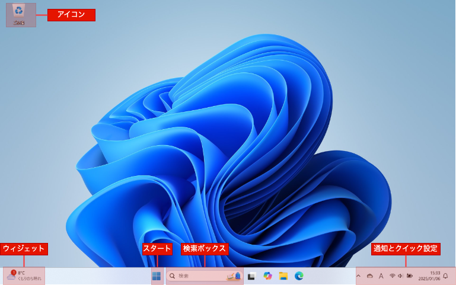
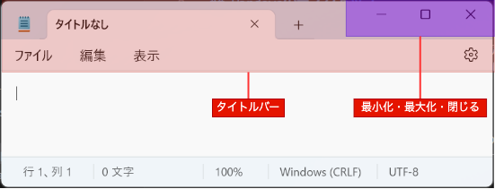
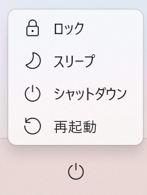

# デスクトップ

パソコンにログインすると、最初に表示される画面が**デスクトップ**（desktop）です。

:::{figure-md} desktop

デスクトップの基本画面
:::

Windowsのデスクトップには、以下の要素があります。

- **アイコン**（icon）: ファイル、フォルダ、アプリケーションなどを表す図形。ダブルクリックすると、アプリケーションを起動したり、ファイルやフォルダを開いたりします。
- **タスクバー**（taskbar）: 画面下部に表示されるバー。タスクバーを右クリックし、「タスクバーの設定」をクリックすると、タスクバーの設定を変更できます。
  - **ウィジェット**（Widget）: 天気予報やニュースなどの情報を表示する。
  - **スタート**（Start）: スタートメニューを表示するボタン。スタートメニューから「すべて」をクリックすると、アプリケーションの一覧が表示されます。
  - **検索ボックス**（Search Box）: アプリやファイルを検索するためのボックス。
  - **通知とクイック設定**（notification and quick settings）: 通知や設定を表示する。Wi-Fi、Bluetooth、画面の明るさなどの設定があります。

## ウィンドウ

ウィンドウ（window）とは、情報を表示するための領域です。ほとんどのウィンドウには、以下のような共通要素があります。

:::{figure-md} notepad

メモ帳のウィンドウ
:::

- **タイトルバー**（title bar）: ウィンドウの最上部にあり、アプリ名を表示します。ウィンドウを移動し、最小化、最大化、閉じるなどの操作を行うことができます。
  - **最小化**（Minimize）: ウィンドウは消しますが、タスクバーのアイコンをクリックすると、ウィンドウが復元します。
  - **最大化**（Maximize）: ウィンドウを画面いっぱいに表示します。
  - **閉じる**（Close）: ウィンドウを閉じます。

アプリによってウィンドウのデザインは異なりますが、基本的な操作は共通しています。

## 電源の操作

スタートメニューから電源ボタンをクリックすると、電源の操作ができます。

:::{figure-md} power

電源の操作
:::

電源メニューには、以下の項目があります。

- **ロック**（Lock）: ロック画面に切り替えます。ロックすると、サインインしないとパソコンを使用できません。一時的にパソコンを離れるときに使います。
- **スリープ**（Sleep）: パソコンをスリープ状態にします。スリープ状態では、パソコンは電源は入っていますが、低電力状態になります。パソコンを短時間使用しないときに使います。 ほとんどのPCでは、PCの電源ボタンを押す、任意のキーを押す、またはマウスを動かすことでスリープ状態から復帰できます。
- **シャットダウン**（Shut down）: シャットダウンすると、すべてのアプリを終了し、パソコンの電源を切ります。
- **再起動**（Restart）: すべてのアプリを終了し、パソコンの電源を切り、もう一度起動します。

## ショートカットキー

**ショートカット**（shortcut）は、キーボードのキーまたはキーの組み合わせで、特定の機能を実行する方法です。

効率よく作業を進めるために、よく使うものは覚えておきましょう。

|          ショートカット           | 説明                       |
| :-------------------------------: | :------------------------- |
|        <kbd>Windows</kbd>         | スタートメニューを開く     |
| <kbd>Windows</kbd> + <kbd>S</kbd> | 検索ボックス               |
| <kbd>Windows</kbd> + <kbd>L</kbd> | ロック                     |
| <kbd>Windows</kbd> + <kbd>M</kbd> | すべてのウィンドウを最小化 |
|  <kbd>Alt</kbd> + <kbd>Tab</kbd>  | ウィンドウの切り替え       |
|  <kbd>Ctrl</kbd> + <kbd>F</kbd>   | 検索                       |

## 練習

:::{note}
質問があるときは、手を挙げてその場でTAに聞いてください。

練習問題は採点しませんので、TAに確認してもらう必要はありません。
:::

1. 検索ボックスから「メモ帳」を検索し、起動してみよう。
2. メモ帳のウィンドウを最大化、最小化、閉じる操作を試してみよう。
3. スタートメニューから「電卓」を起動してみよう。
   - 「スタート」→「すべて」をクリックし、「電卓」を選択します。
4. このページで、<kbd>Ctrl</kbd> + <kbd>F</kbd>を使って、「検索ボックス」というキーワードを検索してみよう。
5. <kbd>Alt</kbd> + <kbd>Tab</kbd>を押して、ウィンドウを切り替えてみよう。