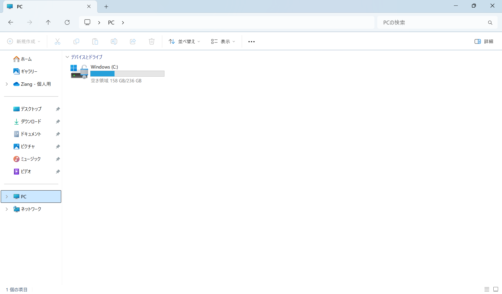

# エクスプローラー

**エクスプローラー**（Explorer）は、Windows に搭載されているファイルやフォルダーを管理するためのアプリケーションです。

<!-- エクスプローラーを使うと、保存されているファイルやフォルダーを分かりやすく管理することができます。 -->

<!-- 正式にはファイル エクスプローラー（File Explorer）ですが、一般的にはエクスプローラーと呼ばれています。 -->

次のいずれかの方法でエクスプローラーを開けます。

- タスクバーにあるエクスプローラーのアイコンをクリックします。
- <kbd>Windows</kbd> + <kbd>E</kbd> のショートカットキーを押します。

## エクスプローラーの構成

エクスプローラーは、次のような構成になっています。

:::{figure-md} explorer


エクスプローラーの基本画面
:::

### ツールバー

エクスプローラーのツールバーには、新規作成、コピー、貼り付け、削除、並べ替えなどの操作を行うためのボタンが表示されています。

### アドレスバー

アドレスバーには、フォルダーのパス（場所）が表示されています。**パス**（path）は、ファイルやフォルダーの場所を示す文字列です。アドレスバーの空白部分をクリックすると、パスが選択され、編集することができます。また、空白部分を右クリックすると、パスのコピー、切り取り、貼り付けなどの操作を行うことができます。

### 検索ボックス

エクスプローラーの検索ボックスにキーワードを入力すると、ファイルやフォルダーを検索することができます。

### ナビゲーションウィンドウ
下の表は、ナビゲーションウィンドウに表示される項目とその説明です。
用途に応じて、適切な項目を使ってファイルやフォルダーを管理しましょう。

| 要素         | 説明                                                 |
| :----------- | :--------------------------------------------------- |
| ホーム       | エクスプローラーのホーム画面、起動時に表示される     |
| ギャラリー   | 画像や動画のファイルをサムネイルで表示する           |
| OneDrive     | Microsoft のクラウドストレージサービス               |
| デスクトップ | デスクトップに保存されているファイルやフォルダー     |
| ダウンロード | インターネットからダウンロードしたファイルの保存場所 |
| ドキュメント | 一般的なドキュメントファイルの保存場所               |
| ピクチャ     | 画像ファイルの保存場所                               |
| ミュージック | 音楽ファイルの保存場所                               |
| ビデオ       | 動画ファイルの保存場所                               |

### ファイルリスト

ファイルリストには、フォルダー内のファイルやフォルダーが表示されます。ファイルリストの空白部分を右クリックすると、新規作成、並べ替えなどの操作を行うことができます。

## 階層構造
Windowsのパソコンでは、ファイルやフォルダーを階層構造で管理されています。 例えば、`C:\Users\taro\Documents\foo.txt` というパスは、`C:` ドライブの `Users` フォルダーの `taro` フォルダーの `Documents` フォルダーにある `foo.txt` というファイルを示しています。日本語のWindowsでは、「\」の代わりに「¥」が使われています。日本語のWindowsでは、パスは次のように表示されます。`C:¥Users¥taro¥Documents¥foo.txt`。

::::{Note}
「\」はバックスラッシュ（backslash）、「¥」は円マーク（yen mark）と呼ばれます。日本語のOS環境ではバックスラッシュが円記号として表示されることが多いです。プログラミングでは、よく使われる記号なので覚えておきましょう。
::::

下記の例では、「courses」というフォルダーに「c_programming」というフォルダーがあり、その中に「code」と「slides」というフォルダーと「syllabus.pdf」というファイルがある構造を示しています。

```plaintext
courses
├── c_programming
│   ├── code
│   │   ├── hello.c
│   ├── slides
│   │   ├── lesson_1.pptx
│   ├── syllabus.pdf
hobbies
├── books
│   ├── how_to_read_a_book.pdf
```

## 作業フォルダー

作業フォルダーは、プロジェクトや課題ごとにファイルやフォルダーを保存するためのフォルダーです。通常、作業フォルダーは、「ドキュメント」フォルダー内に作成されます。

:::{note}
パスに日本語が含まれている場合、プログラムの実行時にエラーが発生することがあります。
:::

「ドキュメント」フォルダーは、`C:\Users\<YourName>\Documents` にあります。ここで、`<YourName>` はパソコンのユーザー名に置き換えてください。例えば、ユーザー名が `taro` の場合、「ドキュメント」フォルダーのパスは `C:\Users\taro\Documents` になります。

ユーザー名は、パソコンを初めて起動したときに自動的に作成されます。
- コマンドプロンプトで確認する
   - <kbd>Windows</kbd> + <kbd>R</kbd> を押して、`cmd` と入力し、<kbd>Enter</kbd> を押します。
   - コマンドプロンプトが開いたら、`whoami` と入力し、<kbd>Enter</kbd> を押します。
   - 表示された結果の最初の部分がユーザー名です。
- エクスプローラーで確認する
  - エクスプローラーのアドレスバーに `C:\Users` と入力して、<kbd>Enter</kbd> を押します。
  - 表示されたフォルダーの中にあるフォルダーがユーザー名です。

## ショートカット

|          ショートカット           | 説明                                     |
| :-------------------------------: | :--------------------------------------- |
| <kbd>Windows</kbd> + <kbd>E</kbd> | エクスプローラーを開く                   |
|   <kbd>Ctl</kbd> + <kbd>C</kbd>   | ファイルやフォルダーをコピー             |
|   <kbd>Ctl</kbd> + <kbd>V</kbd>   | コピーしたファイルやフォルダーを貼り付け |
|   <kbd>Ctl</kbd> + <kbd>X</kbd>   | ファイルやフォルダーを切り取り           |

## 演習

1. ショートカットでエクスプローラーを開いてみよう。
2. `C:\Users\YourName\Documents` に「計算機実習A」フォルダーを作成してみよう。ただし、`YourName` は自分のユーザー名に置き換えること。
3. 「計算機実習A」のパスを確認してみよう。