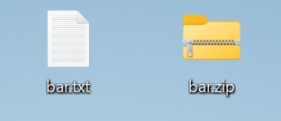
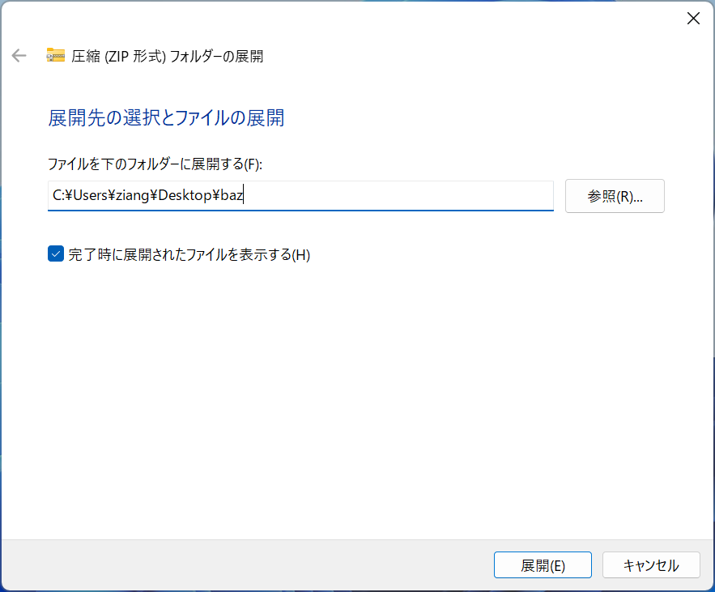

# ファイルとフォルダー

**ファイル**(file) とは、ある記録媒体に記録したデータの集まりです。

**フォルダー**(folder) とは、ファイルや他のフォルダーを整理してまとめるための「入れ物」です。

## フォルダーを作成してみよう

1. デスクトップの空いている場所を右クリックします。
2. 表示されたメニューから「新規作成」を選択します。
3. 「フォルダー」を選択します。新しいフォルダーのアイコンが表示されます。
4. フォルダー名に「foo」と入力し、<kbd>Enter</kbd> キーを押します。

:::{figure-md} new

新規作成のメニュー
:::

:::{figure-md} new-folder

フォルダーの新規作成
:::

### テキストファイルを作成してみよう

1. デスクトップの空いている場所を右クリックします。
2. 表示されたメニューから「新規作成」を選択します。
3. 「テキスト ドキュメント」を選択します。新しいテキストファイルのアイコンが表示されます。
4. ファイル名に「foo.txt」と入力し、<kbd>Enter</kbd> キーを押します。

:::{figure-md} new-txt

テキストファイルの新規作成
:::

:::{note}
テキストファイルには自動で「.txt」がつきます。手動で「.txt」と入力しても構いませんが、重複しないよう注意しましょう。
:::

<!-- 以上の手順で「foo.txt」と「foo」という名前のフォルダーが作成されます。

:::{figure-md} new-result

新規作成の結果
::: -->

<!-- ## プロパティの確認

作成したフォルダーやファイルを右クリックすると、切り取り、コピー、削除、名前の変更、開く、プロパティの確認などの操作を行うことができます。

:::{figure-md} foo

フォルダーの基本操作
:::

### テキストファイルのプロパティを確認してみよう

ファイルやフォルダーの詳細情報を確認するためには、対象のファイルやフォルダーを右クリックして「プロパティ」を選択します。すると、ファイルやフォルダーの詳細情報が表示されます。

例えば、デスクトップ上で`foo.txt`を右クリックして「プロパティ」を選択します。すると、以下のようなウィンドウが表示されます。`foo.txt`のプロパティウィンドウには、ファイルの名前、サイズ、作成日時、更新日時、場所などの情報が表示されます。

:::{figure-md} foo_txt

ファイルのプロパティ
:::

この図を見ると、ファイルの名前が `foo.txt` で、ファイルの種類が `テキスト ドキュメント` であることがわかります。それでは、「.txt」の部分は何を意味しているのでしょうか。 -->

## 拡張子とは

ファイル名の末尾にある「.txt」の部分を**拡張子**（extension）といいます。
拡張子はファイルの種類を表します。例えば：

- `.txt`：テキストファイル
- `.docx`：Microsoft Wordファイル
- `.pdf`：PDFファイル
- `.jpg`：画像ファイル

:::{figure-md} extension

拡張子の例
:::

<!-- Windowsでは、ファイル名にはベースファイル名と拡張子が含まれています。ベースファイル名はファイルの内容を表す名前で、拡張子はファイルの種類を示す名前です。拡張子は通常、ファイル名の最後に付けられ、ピリオド（.）でファイル名と拡張子が区切られています。例えば、`foo.txt` というファイル名の場合、`foo` がベースファイル名で、`.txt` が拡張子です。 -->

## 圧縮と解凍

**圧縮**とは、データのサイズを小さくすることです。

**解凍**とは、圧縮されたデータをもとに戻すことです。

圧縮・解凍を使うと、複数ファイルを1つにまとめて送信したり、保存容量を節約することができます。

### 圧縮の手順

ここでは「bar.txt」を例として圧縮の手順を説明します。

1. 「bar.txt」を右クリックして「圧縮先...」を選択します。
2. 「ZIPファイル」を選択します。
3. 「bar.zip」というファイルが作成されます。

:::{figure-md} compress

圧縮
:::

:::{figure-md} zip

作成されたZIPファイル
:::

### 解凍の手順

1. 圧縮したファイルを右クリックして「すべて展開...」を選択します。
2. 展開先フォルダーを指定し、「展開」をクリックします。

:::{figure-md} decompress-1

展開
:::

:::{figure-md} decompress-2

展開先の選択
:::

## 練習

:::{note}
質問があるときは、手を挙げてその場でTAに聞いてください。

練習問題は採点しませんので、TAに確認してもらう必要はありません。
:::

1. デスクトップに「foo」というフォルダーを作成してみよう。
2. 「foo」フォルダー内に「bar」というフォルダーと「bar.txt」というテキストファイルを作成してみよう。
3. 「bar.txt」を圧縮してみよう。
4. 圧縮したファイルを解凍してみよう。