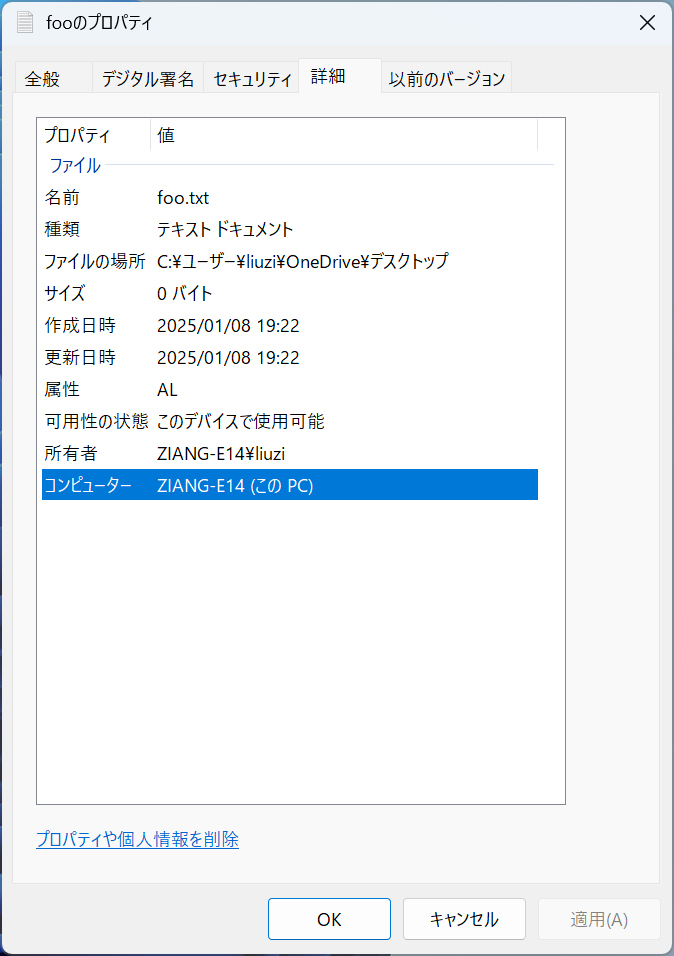

# ファイルとフォルダー

**ファイル**(file) とは、ある記録媒体に記録したデータの集まりのことです。

**フォルダー**(folder) とは、ファイルを整理して保存するための場所です。フォルダーには、ファイルや他のフォルダーを保存することができます。

## ファイルとフォルダーの新規作成

ファイルとフォルダーの新規作成の手順は以下の通りです。

1. デスクトップ上で右クリックします。
2. 表示されたメニューから「新規作成」を選択します。
3. 新規作成のメニューから作成したいファイルやフォルダーの種類を選択します。

:::{figure-md} new

新規作成のメニュー
:::

### フォルダーを作成してみよう
1. デスクトップ上で右クリックし，「新規作成」を選択します。
2. 新規作成のメニューから「フォルダー」を選択します。
3. 「foo」という名前を入力して、<kbd>Enter</kbd> キーを押します。

:::{figure-md} new-folder

新規作成のメニュー
:::

### テキストファイルを作成してみよう

1. デスクトップ上で右クリックし，「新規作成」を選択します。
2. 新規作成のメニューから「テキスト ドキュメント」を選択します。
3. 「foo.txt」という名前を入力して、<kbd>Enter</kbd> キーを押します。

:::note
テキストファイルを新規作成する場合、自動的に「.txt」が付加されますので、ファイル名を入力する際に「.txt」を入力する必要はありません。
:::

:::{figure-md} new-txt

新規作成のメニュー
:::

以上の手順で「foo.txt」と「foo」という名前のフォルダーが作成されます。

:::{figure-md} new-result

新規作成の結果
:::

<!-- ## プロパティの確認

作成したフォルダーやファイルを右クリックすると、切り取り、コピー、削除、名前の変更、開く，プロパティの確認などの操作を行うことができます。

:::{figure-md} foo

フォルダーの基本操作
:::

### テキストファイルのプロパティを確認してみよう

ファイルやフォルダーの詳細情報を確認するためには、対象のファイルやフォルダーを右クリックして「プロパティ」を選択します。すると、ファイルやフォルダーの詳細情報が表示されます。

例えば，デスクトップ上で`foo.txt`を右クリックして「プロパティ」を選択します。すると、以下のようなウィンドウが表示されます。`foo.txt`のプロパティウィンドウには、ファイルの名前，サイズ、作成日時、更新日時、場所などの情報が表示されます。

:::{figure-md} foo_txt

ファイルのプロパティ
:::

この図を見ると、ファイルの名前が `foo.txt` で、ファイルの種類が `テキスト ドキュメント` であることがわかります。それでは，「.txt」の部分は何を意味しているのでしょうか。 -->

## 拡張子

新規作成したテキストファイルは自動的に「.txt」という文字列が付加されます。この「.txt」という文字列は、拡張子と呼ばれます。

**拡張子**（file name extension）は、ファイルの種類を識別するための文字列です。`.txt`以外にも、`.docx`（Microsoft Word）、`.pdf`（Adobe PDF）、`.jpg`（JPEG画像）など、様々な拡張子があります。

:::{figure-md} extension

拡張子の例
:::

<!-- Windowsでは、ファイル名にはベースファイル名と拡張子が含まれています。ベースファイル名はファイルの内容を表す名前で、拡張子はファイルの種類を示す名前です。拡張子は通常、ファイル名の最後に付けられ、ピリオド（.）でファイル名と拡張子が区切られています。例えば，`foo.txt` というファイル名の場合、`foo` がベースファイル名で、`.txt` が拡張子です。 -->

## 圧縮と解凍

**圧縮**とは、コンピューターのデータをアルゴリズムを使って変換し、サイズを小さくすることです。

**解凍**とは、アルゴリズムを使って変換し、圧縮されたデータをもとに戻すことです。

サイズの大きなファイルを圧縮・解凍することで、ストレージの節約や、ファイルの転送時間を短縮することができます。

### 圧縮の手順

1. 

Windowsでは、ファイルやフォルダーを右クリックして「圧縮先...」を選択し、「ZIPファイル」を選択すると、ファイルやフォルダーを圧縮することができます。また、圧縮したファイルを右クリックして「すべて展開...」を選択すると、ファイルを解凍することができます。

## 練習

1. デスクトップに「計算機実習」という名前のフォルダーを作成してみよう。
2. 「計算機実習」フォルダー内に「課題1」という名前のフォルダーと「task1.txt」という名前のテキストファイルを作成してみよう。
3. 「計算機実習」フォルダーを圧縮して、解凍してみよう。