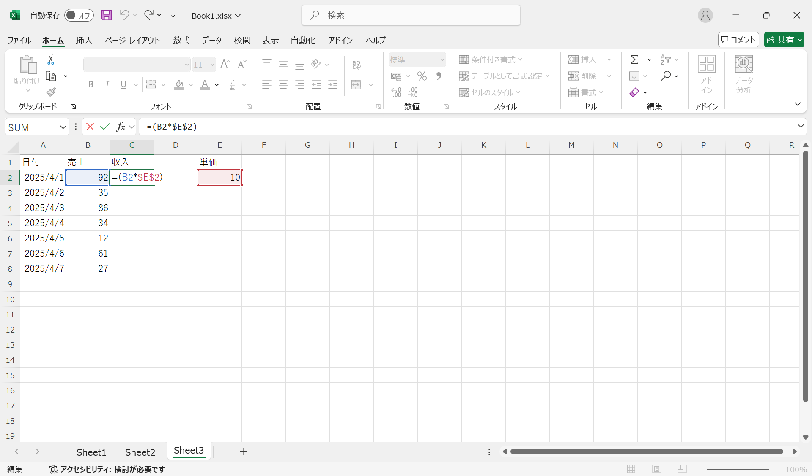

# 計算

ここでは、以下の例を用いて、Excelの計算機能を紹介します。

| 学籍番号 | 数学  | 英語  | 情報  |
| :------: | :---: | :---: | :---: |
|  s1001   |  87   |  92   |  85   |
|  s1002   |  78   |  85   |  90   |
|  s1003   |  55   |  62   |  40   |

## 基本演算

### 演算子

Excelでは、数値の計算を行うために、`=`で始まる数式を使用します。数式には、`+`（加算）、`-`（減算）、`*`（乗算）、`/`（除算）などの演算子を使用します。例えば、成績の合計を計算する場合、以下のように入力して、<kbd>Enter</kbd>キーを押すと、計算結果が表示されます。

```excel
= 87 + 92 + 85
```

:::{figure-md} excel_calculation


基本的な計算
:::

### 値の参照

Excelでは、他のセルの値を参照して計算を行うことができます。例えば、数学の成績の合計を計算する場合、以下のように入力します。

```excel
= B3 + C3 + D3
```

:::{figure-md} excel_reference


値の参照
:::

以下では、例を使って、参照の書式を説明します。

- `A10`：列A、行10のセル
- `B3:D3`：行3、列BからDの範囲
- `A1:A10`：列A、行1から10の範囲
- `B3:D10`：行3〜10、列B〜Dの範囲


### 初めての関数

Excelには、さまざまな関数が用意されています。関数を使用することで、複雑な計算を簡単に行うことができます。例えば、合計を計算する場合、`SUM`関数を使用します。`SUM`関数は、指定した範囲内の数値を合計するための関数です。以下の数式は、`B4`から`D4`の範囲内の数値を合計します。

```excel
= SUM(B4:D4)
```

:::{figure-md} excel_function


初めての関数
:::

### 小数点数

`AVERAGE`関数を使って、`s1001`の数学、英語、情報の平均点を計算してみましょう。`B2:D2`の範囲を選択して、`F2`に以下の数式を入力します。

```excel    
= AVERAGE(B2:D2)
```

平均値は整数部分で表示されます。小数点以下の値を表示するには、「数値」グループの「小数点以下の表示桁数を増やす」ボタンをクリックします。

:::{figure-md} excel_decimal


小数点数
:::

### 連続データの計算

そして、マウスでセルの右下隅をドラッグすると、他の行にも同じ計算を適用できます。

:::{figure-md} excel_average


連続データの計算
:::

## 参照

Excelでは計算を行うために、参照機能がよく使われます。**参照**とは、他のセルの値を使用して計算を行うことです。

Excelでは、**相対参照**、**絶対参照**、**混合参照**の3つの参照方法があります。これらの機能を使い分けることで、計算を効率的に行うことができます。

### 相対参照

Excelでは、デフォルトで相対参照が使用されます。相対参照は、数式をコピーしたときに、参照先のセルが自動的に変更されることを意味します。

例えば、上記の連続データの計算の例では、自動的に参照を更新することで、計算を行います。`F2`に入力した`= AVERAGE(B2:D2)`という数式を、3〜４行目にドラッグすると、`F3`には`= AVERAGE(B3:D3)`、`F4`には`= AVERAGE(B4:D4)`という数式が自動的に適用されます。これは、**相対参照**といいます。

### 絶対参照

絶対参照は、数式をコピーしても参照先のセルが変更されないことを意味します。絶対参照を使用するには、セルの行番号と列番号の前に`$`を付けます。
例えば、`$A$1`は、列A、行1のセルを絶対参照します。数式をコピーしても、参照先は常に`$A$1`になります。


例えば、以下の例では、収入を計算するために、`売上*単価`を計算します。単価は、`E1`に入力されているとき、それを絶対参照するために、`C2`に以下の数式を入力します。

```excel
= B2 * $E$1
```

この数式を`C3`にコピーすると、`C3`には`= B3 * $E$1`という数式が自動的に適用されます。

:::{figure-md} absolute_reference


絶対参照の例
:::

### 混合参照

混合参照は、行番号または列番号のいずれか一方だけを固定することができる参照方法です。例えば、`$A1`は、列Aを絶対参照し、行番号は相対参照します。逆に、`A$1`は、行1を絶対参照し、列番号は相対参照します。

例えば、以下の例では、掛け算の九九を計算するために、`$A2`と`B$1`を混合参照します。`$A2`は、列Aを絶対参照し、行番号は相対参照します。逆に、`B$1`は、行1を絶対参照し、列番号は相対参照します。

:::{figure-md} mixed_reference


混合参照の例
:::

## 練習

### 問題1：九九の表

複合参照を使用して、九九の表を作成してみよう．

### 問題2：消費税

消費税を10%とした場合、以下の表を作成してみよう．消費税，合計は参照を使って計算すること．将来的に消費税率が変更された際にも対応できるよう、消費税率は別のセルに入力し、数式ではそのセルを参照するようにすること．

| 商品名 | 単価  | 数量  | 消費税 | 合計  |
| :----: | :---: | :---: | :----: | :---: |
| 商品A  | 1000  |   2   |  200   | 2200  |
| 商品B  | 2000  |   1   |  200   | 2200  |
| 商品C  | 1500  |   3   |  450   | 4950  |

### 問題3：需要予測

移動平均（Moving Average）とは，与えられたデータの平均を計算し，未来の値を予測する手法です．$D_i$を$i$日目の需要，$N$を移動平均の期間，$y_t$を$t$日目の移動平均とすると，$y_t$は次のように計算されます．

$$
y_t = \frac{1}{N} \sum_{i=t-N}^{t-1} D_{i}
$$

例えば，以下のような需要データがあるとします．

| 日付  | 需要  |
| :---: | :---: |
|   1   |  100  |
|   2   |  120  |
|   3   |  130  |
|   4   |  105  |
|   5   |  110  |

$N=3$とした場合，$y_6$は次のように計算されます．

$$
y_6 = \frac{1}{3} (D_3 + D_4 + D_5) = \frac{1}{3} (130 + 105 + 110)
$$

以上の問題に対して，Excelを用いて移動平均を計算する数式を作成してみよう．$N$の値は，Excelのセルに入力して参照すること．

