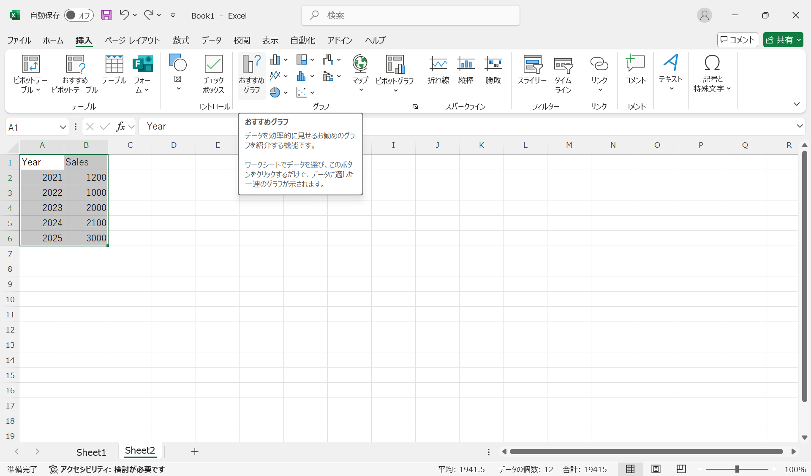
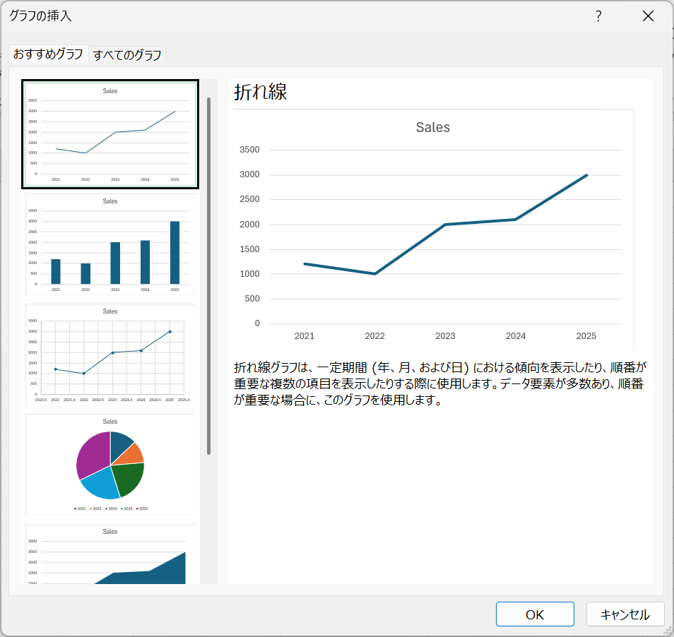
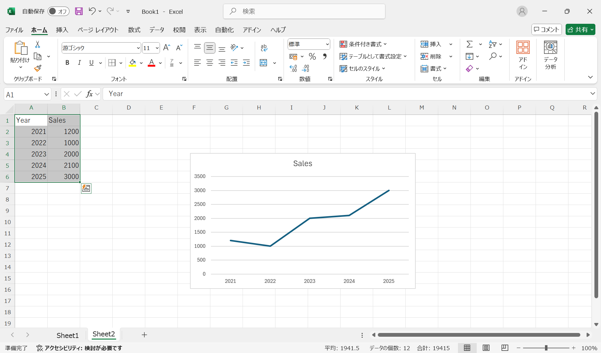
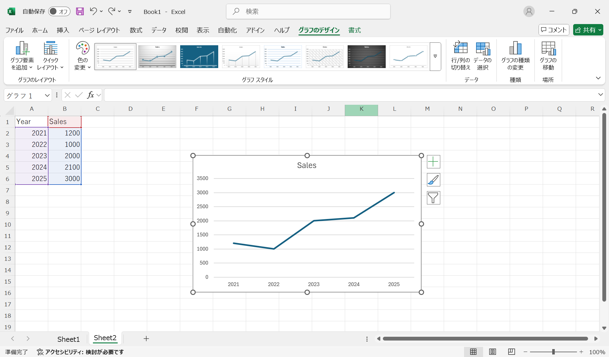
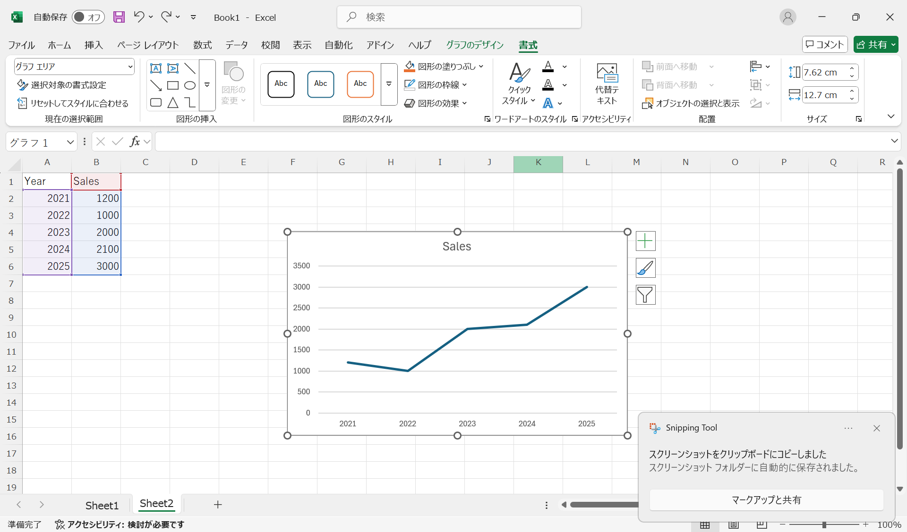
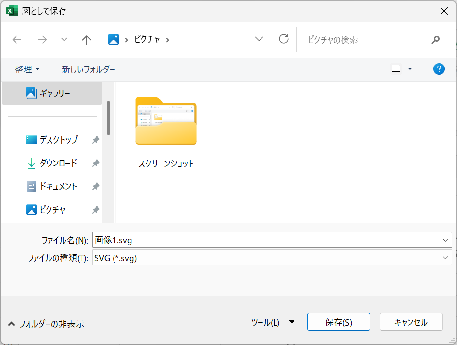

# グラフ

グラフは、データを視覚的に表現するための便利な道具です。Excelでは、データをもとにさまざまな種類のグラフを作成できます。以下では、Excelでのグラフの作成方法について説明します。

## 初めてのグラフを作成する

以下のデータをExcelに入力し、グラフを作成してみましょう。

| Year | Sales |
| ---- | ----- |
| 2021 | 1200  |
| 2022 | 1000  |
| 2023 | 2000  |
| 2024 | 2100  |
| 2025 | 3000  |

マウスで入力したデータを選択し、「挿入」タブの「グラフ」グループから「おすすめグラフ」を選択します。

:::{figure-md} recommend_graph

「おすすめグラフ」ボタン
:::

すると、「グラフの挿入」ダイアログが表示されます。ここで、Excelがデータに基づいておすすめするグラフの種類が表示されます。**折れ線**グラフを選択し、「OK」ボタンをクリックします。

:::{figure-md} insert_graph

「グラフの挿入」ダイアログ
:::

:::{note}
Excelの「グラフの挿入」ダイアログでは、グラフについての説明が表示されるので、参考にしてください。

例えば、「折れ線グラフは、一定期間（年、月、および日）における傾向を表示したり、順番が重要な複数の項目を表示したりする際に使用します。」といった説明が表示されます。今回のデータは、年ごとの売上を示しているので、折れ線グラフが適しています。
:::

下記のようなグラフが作成されます。

:::{figure-md} graph

グラフ
:::

## グラフのデザインと書式

作成したグラフをマウスで選択すると、リボンに「グラフのデザイン」タブと「書式」タブが表示され、グラフの編集が可能になります。

:::{figure-md} graph_design

「グラフのデザイン」タブ
:::

:::{figure-md} graph_format

「書式」タブ
:::

## グラフの保存

作成したグラフは、画像ファイルとして保存できます。

右クリックして「図として保存」を選択すると、「図として保存」ダイアログが表示されます。

:::{figure-md} save_graph

「図として保存」ダイアログ
:::

ファイルの種類では、下記のような形式が選択できます。

- PNG(*.png)
- JPEG(*.jpg)
- GIF(*.gif)
- TIFF(*.tif)
- Windows ビットマップ(*.bmp)
- SVG(*.svg)

画像の表現形式として、**ベクター画像**（Vector Graphics）と**ラスター画像**（Raster Graphics）に分けられます。

- ベクター画像：線や図形の情報を数式で表現した画像。拡大しても劣化しない。SVG形式は代表的なベクター画像形式。
- ラスター画像：ピクセルの集まりで表現した画像。拡大すると劣化する。PNG、JPEG、GIF、TIFF、BMP形式はラスター画像形式。

ベクター画像は、拡大しても劣化しないため、理科系のレポートや論文などで優先的に使用されます。

ここでは、**SVG**形式を選択して保存します。

:::{figure-md} save_graph_svg

SVG形式で保存
:::

保存された画像ファイルはWordやPowerPointなどに貼り付けることができます。詳細は、[Wordの画像の挿入](../word/edit.md#画像の挿入)を参照してください。

## グラフの種類

目的に応じたグラフを選択することで、伝えたい情報をより効果的に相手に伝えることができます。

ここでは、よく使われるグラフをいくつか紹介します。

### 折れ線グラフ

**折れ線グラフ**（Line Chart, or Line Graph）は、時系列データを表現するのによく使われます。横軸に時間、縦軸に数値をとり、各データポイントを直線で結びます。データの変化を視覚的に把握しやすく、傾向を示すのに適しています。

例
- 在庫の推移
  - 横軸：時間
  - 縦軸：在庫量
- 気温の変化
  - 横軸：時間
  - 縦軸：気温

### 棒グラフ

**棒グラフ**（Bar Chart, or Bar Graph）は、棒の高さで数値を表現します。横軸に項目、縦軸に数値をとり、各項目の値を棒で示します。横棒グラフの場合は、縦軸に項目、横軸に数値をとります。棒グラフは、項目ごとの数値を比較するのに適しています。

例
- 売上の比較
  - 横軸：商品名
  - 縦軸：売上金額
- 各国の人口
  - 横軸：国名
  - 縦軸：人口

### 散布図
**散布図**（Scatter Plot, or Scatter Chart）は、2つの数値データの関係を示すのに適しています。横軸と縦軸にそれぞれ数値をとり、各データポイントを点で示します。データの分布や相関関係を視覚的に把握するのに役立ちます。

例
- 身長と体重の関係
  - 横軸：身長
  - 縦軸：体重
- 学力と学習時間の関係
  - 横軸：学習時間
  - 縦軸：テストの点数

### 円グラフ

**円グラフ**（Pie Chart）は、全体に対する各項目の割合を示すのに適しています。円グラフは、全体に対する各項目の比率を視覚的に把握するのに役立ちます。

例
- 消費支出
  - 項目：食費、住居費、交通費、娯楽費、その他
  - 割合：各項目の支出額を全体の支出額で割った値
- 意見調査
  - 項目：賛成、反対、中立
  - 割合：各項目の人数を全体の人数で割った値

### 箱ひげ図

**箱ひげ図**（Box Plot）は、データの分布を視覚的に示すのに適しています。箱ひげ図は、下記の統計量をグラフで示すことができます。

- 最小値
- 第1四分位数
- 中央値
- 第3四分位数
- 最大値

例
- 各クラスのテストの点数
  - 横軸：クラス名
  - 縦軸：点数

## 練習

### 問題1：日本の平均寿命

以下の[データ](https://www.mhlw.go.jp/stf/wp/hakusyo/kousei/19/backdata/01-01-02-01.html)をもとに，グラフを作成せよ．グラフに基づき，考察を行え．

| 年度   | 男    | 女    |
| ------ | ----- | ----- |
| 2005年 | 78.56 | 85.52 |
| 2010年 | 79.55 | 86.3  |
| 2015年 | 80.75 | 86.99 |
| 2018年 | 81.25 | 87.32 |
| 2019年 | 81.41 | 87.45 |