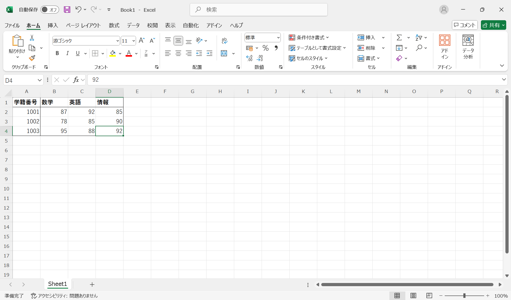

# Excelの起動

Excelを起動すると、次のような画面が表示されます。「空白のブック」を選択すると、新しいExcelファイルが作成されます。

:::{figure-md} excel_start

Excelの起動画面
:::

## Excelのが画面構成

<!-- https://infinity-i.co.jp/support/2438/#no30 -->

空白のブックを選択すると、以下のような画面が表示されます。

:::{figure-md} excel_blank

Excelの基本画面
:::

1. クイックアクセスツールバー：よく使う機能のアイコンが表示されている
2. リボン
   1. タブ：ファイル、ホーム、挿入、ページレイアウト、数式、データ、校閲、表示などのタブがある
   2. グループ：タブ内の機能がグループ化されている。例えば、「ホーム」タブにはクリップボード、フォント、配置、数値などのグループがある
   3. コマンド：リボン内の各機能を実行するためのボタン。
3. 名前ボックスと数式バー
   1. 名前ボックス：現在選択しているセルの位置を表示する。例えば、A1はA列1行目のセルを指す
   2. 数式バー：選択したセルの内容を表示する。数式や関数を入力することもできる
4. セル：数値、文字列、数式などのデータを入力するためのマス目。行と列で構成されている
5. シートタブ：現在のシートの名前が表示されている。＋をクリックすると新しいシートを追加できる
6. ステータスバー：現在のシートの情報や、平均、データの個数、合計などの情報が表示される
7. スクロールバー：シートを上下左右にスクロールするためのバー
8. ズームスライダー：シートの表示倍率を調整するためのスライダー

:::{note}
Excelの**ブック**は一つのファイルを指します。ブックの中には一つ以上の**シート**が含まれています。シートは、**セル**で構成されています。セルの位置は、列（A、B、C...）と行（1、2、3...）の組み合わせで表されます。
:::

## Excelの基本操作

### データの入力

セルを選択して、数値や文字列を入力します。<kbb>Enter</kbd>キーを押すと、下のセルに移動します。<kbd>Tab</kbd>キーを押すと、右のセルに移動します。

まずは、以下のデータを入力してみましょう。学籍番号や成績は半角数字で入力してください。

| 学籍番号 | 数学  | 英語  | 情報  |
| :------: | :---: | :---: | :---: |
|   1001   |  87   |  92   |  85   |
|   1002   |  78   |  85   |  90   |
|   1003   |  95   |  88   |  92   |

### フォントの設定

「ホーム」タブの「フォント」グループの機能を使って、表の見た目を整えます。

:::{figure-md} excel_input

データの入力
:::

ここでは、太字と罫線を使います。太字は、フォントの「B」アイコンをクリックするか、<kbd>Ctrl</kbd> + <kbd>B</kbd>キーを押すことで設定できます。罫線は、フォントの「罫線」アイコンをクリックして、罫線の種類を選択します。

:::{figure-md} excel_font

フォントの設定
:::

### 数値の書式

Excelでは、「数値」、「通貨」、「パーセンテージ」などの書式を設定できます。数値の書式を変更するには、セルを選択して、「ホーム」タブの「数値」グループから書式を選択します。

:::{figure-md} excel_format

数値の書式
:::

ここでは成績の部分を選択し、「数値」を選択します。

:::{figure-md} excel_format_number

数値の書式
:::

学籍番号は「文字列」に設定します。変更すると、学籍番号が左寄せになります。

:::{note}
学籍番号は一般的に数値ではなく文字列として扱われます。学籍番号は識別するためのもので、計算を行う必要はありません。また、「0001」という学籍番号は、数値として扱うと「1」となってしまいます。
:::

:::{figure-md} excel_format_string

文字列の書式
:::

:::{note}
Excelでは、適切に書式を設定することが重要です。書式を適切に設定しないと、計算やデータの処理に影響を与えることがあります。

例えば、成績を「数値」として扱うと、平均値、最大値、最小値、ソートなどの計算が正しく行えます。一方、学籍番号を「文字列」として扱うと、テキストの検索、結合、置換などの操作が可能になります。
:::

## 保存

Excelファイルを保存するには、以下の手順を行います。

1. 「ファイル」タブをクリックします。
2. 「名前を付けて保存」を選択します。
3. 保存先を選択します。
4. ファイル名を入力します。
5. 「保存」ボタンをクリックします。

