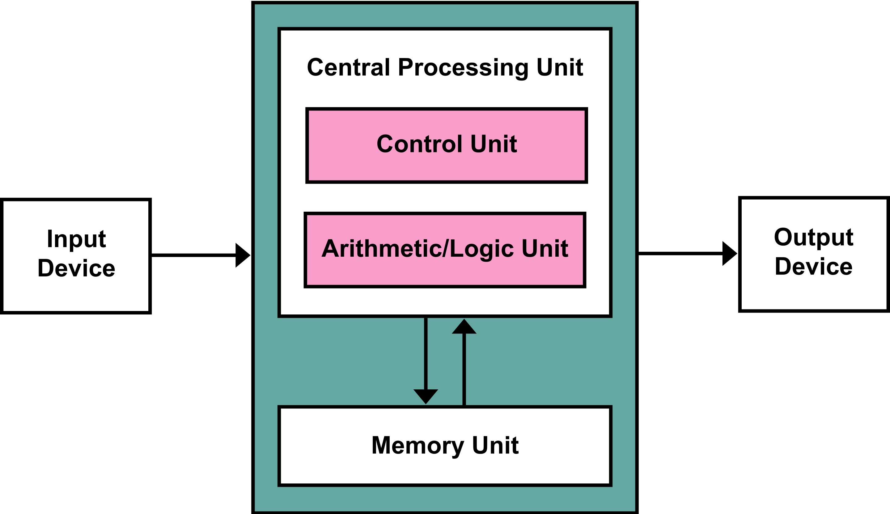

# コンピューターとは

**コンピューター**（computer）とは，電子回路を用い，指示された通り自動的に計算やデータ処理を行う装置で，**電子計算機**とも呼ばれる．**計算機**という言葉は，狭義では電子計算機を指すが，広義では計算を行う装置全般を指す．

コンピューターには，日常生活で使われるパソコン（パーソナルコンピュータ）をはじめ，スーパーコンピューター，スマートフォン，タブレットなど様々な種類がある．

:::{figure-md} Fugaku

日本のスーパーコンピューター「富岳（ふがく）」 © [Wikipedia](https://commons.wikimedia.org/wiki/File:RIKEN_R-CCS_Fugaku.jpg), [CC BY-SA 3.0](https://creativecommons.org/licenses/by-sa/3.0/deed.en)
:::

## ハードウェアとソフトウェア

コンピューターは，**ハードウェア**（hardware）と**ソフトウェア**（software）から構成される．

ハードウェアは，コンピューターを構成する物理的な装置である．

ノイマン型アーキテクチャ（von Neumann architecture）は，今のほとんどのコンピューターの基盤となるアーキテクチャである．次の図では，ノイマン型アーキテクチャを示している．

:::{figure-md} VonNeumann

ノイマン型アーキテクチャ 
:::