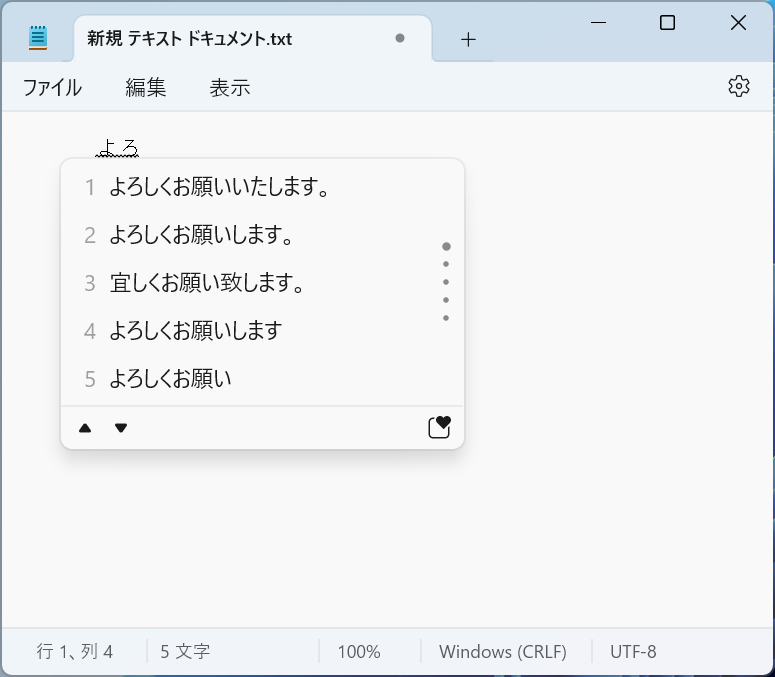
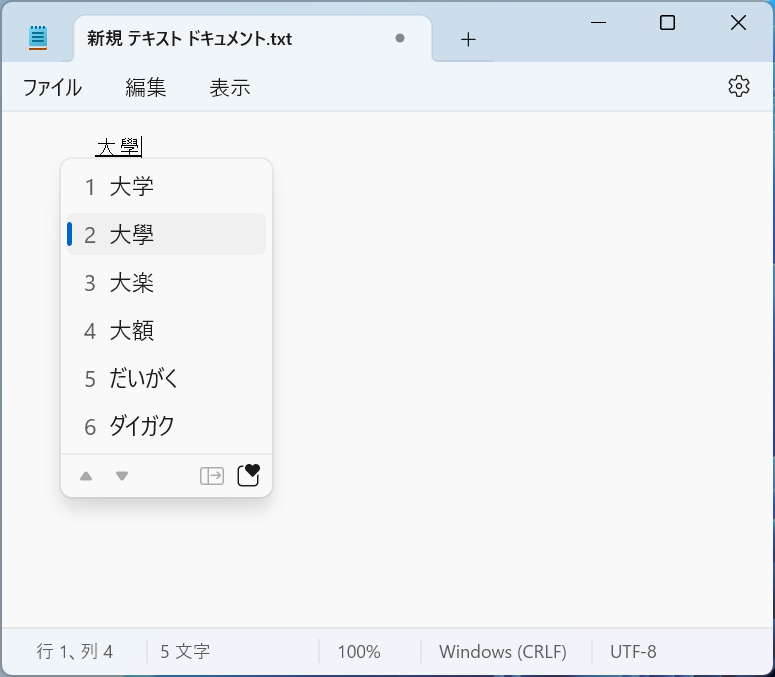

# 日本語入力

Windowsでは、マイクロソフト日本語IME (Input Method Editor)を用いて、ひらがな、カタカナ、漢字を入力することができます。
日本語のキーボードを使用する場合、<kbd>半角/全角</kbd>キーを押すと、日本語入力モードと英数字入力モードを切り替えることができます。

:::{note}
全角モードでは正方形の和文活字、半角モードでは和文活字の半分の大きさの文字が入力されます。
基本、プログラミング言語では、全角文字は使用できません。また、Excelなどの表計算ソフトでは、数値の入力に全角文字を使用するとエラーが発生することがあります。
:::

## ローマ字入力

ここではよく使われる入力方法として、ローマ字入力を紹介します。

### 予測候補

日本語入力モードで、「daigaku」と入力すると、「だいがく」が表示され、その下予測候補ウィンドウに「大学」、「大学院」、「大学生」などの候補が表示されます。<kbd>Tab</kbd>キーを押すと、最初の候補「大学」に移動し、もう一度<kbd>Tab</kbd>キーを押すと、次の候補に移動します。<kbd>Enter</kbd>キーを押すと、選択した候補が入力されます。<kbd>Tab</kbd>キー以外にも、<kbd>↑</kbd>キーと<kbd>↓</kbd>キーを使って候補を選択することができます。

予測候補を使うと、入力する文字を減らすことができ、入力速度が向上します。例えば、「yoro」と入力すると、「よろしくお願いいたします。」などの予測候補が表示されます。

:::{figure-md} prediction

予測候補
:::

### 変換候補

日本語入力モードで、「daigaku」と入力し、<kbd>Space</kbd>キーを押すと、入力内容を「大学」に変換します。もう一度<kbd>Space</kbd>キーを押すと、変換候補ウィンドウが表示されて、「大學」、「大楽」などの候補が表示されます。

:::{figure-md} conversion

変換候補
:::

このウィンドウで<kbd>space</kbd>キーを押すと、次の候補に移動します。また、<kbd>Enter</kbd>キーを押すと、選択した候補が入力されます。

### IMEの設定

IMEの設定を変更するには、IMEのアイコン「A」や「あ」を右クリックし、メニューから設定を変更します。

例えば、句読点を設定するには、IMEのアイコンを右クリックし、「設定」を選択します。次に、「全般」をクリックし、「句読点」を選択します。ここで、句読点「、。」を「，．」などに変更することができます。

## タッチタイピング

タッチタイピング（Touch Typing）とは、キーボードのキーを見ずに、タイピングする方法です。タッチタイピングをすることで、入力する速度が向上できます。

### ホームポジション

タッチタイピングでは、基本の指の位置をホームポジションと呼ばれます。タイピングを始めるときは、各指をホームポジションに軽く置きます。

:::{figure-md} home-position

ホームポジション © [Cy21](https://commons.wikimedia.org/wiki/User:Cy21), [CC BY-SA 3.0](https://creativecommons.org/licenses/by-sa/3.0/deed.en)
:::

タイピングをするときは、このホームポジションから指を動かして、キーを押します。キーを押したら、すぐにホームポジションに戻ります。効率的にタイピングするために、各指が担当するキーを覚えることが重要です。下の図は、各指の担当キーを示しています。

:::{figure-md} home-position-2

各指の担当キー © [Wikipedia](https://commons.wikimedia.org/wiki/File:TouchTyping_HomePosition_QWERTY.png), [CC BY-SA 3.0](https://creativecommons.org/licenses/by-sa/3.0/deed.en)
:::

タッチタイピングを練習するときは、まずホームポジションから指を動かして、キーボードを見ながら各キーを押します。次に、キーボードを見ずに、指の位置を覚えてタイピングします。最初はゆっくりと練習し、徐々にスピードを上げていきます。メモ帳などのアプリケーションを使って、好きな文章を入力して練習するとよいでしょう。また、無料のタッチタイピング練習サイトもありますので、利用してみてください。

- [無料タイピング教材](https://manabi.benesse.ne.jp/gakushu/typing/)
- [寿司打](https://sushida.net)
- [typing.com](https://www.typing.com/)

[typing.com](https://www.typing.com/)は、英語のタッチタイピング練習サイトですが、基本的な姿勢などから丁寧に教えてくれるので、英語での説明が理解できる方におすすめです。

## 練習
1. メモ帳を開いて、好きな日本語の文章を入力してみよう。
2. 句読点を「，．」に変更してみよう。
3. 予測候補と変換候補の違いについて説明してみよう。
4. このサイト（[https://manabi.benesse.ne.jp/gakushu/typing/](https://manabi.benesse.ne.jp/gakushu/typing/)）で、タッチタイピングを練習してみよう。

## 付録

### ローマ字表

|       |  あ   |    い    |    う    |  え   |  お   |    や     |    ゆ     |    よ     |
| :---: | :---: | :------: | :------: | :---: | :---: | :-------: | :-------: | :-------: |
|  あ   |  あ   |    い    |    う    |  え   |  お   |           |           |           |
|       |   a   |    i     |    u     |   e   |   o   |           |           |           |
|  か   |  か   |    き    |    く    |  け   |  こ   |   きゃ    |   きゅ    |   きょ    |
|       |  ka   |    ki    |    ku    |  ke   |  ko   |    kya    |    kyu    |    kyo    |
|  さ   |  さ   |    し    |    す    |  せ   |  そ   |   しゃ    |   しゅ    |   しょ    |
|       |  sa   | si (shi) |    su    |  se   |  so   | sya (sha) | syu (shu) | syo (sho) |
|  た   |  た   |    ち    |    つ    |  て   |  と   |   ちゃ    |   ちゅ    |   ちょ    |
|       |  ta   | ti (chi) | tu (tsu) |  te   |  to   | tya (cha) | tyu (chu) | tyo (cho) |
|  な   |  な   |    に    |    ぬ    |  ね   |  の   |   にゃ    |   にゅ    |   にょ    |
|       |  na   |    ni    |    nu    |  ne   |  no   |    nya    |    nyu    |    nyo    |
|  は   |  は   |    ひ    |    ふ    |  へ   |  ほ   |   ひゃ    |   ひゅ    |   ひょ    |
|       |  ha   |    hi    | hu (fu)  |  he   |  ho   |    hya    |    hyu    |    hyo    |
|  ま   |  ま   |    み    |    む    |  め   |  も   |   みゃ    |   みゅ    |   みょ    |
|       |  ma   |    mi    |    mu    |  me   |  mo   |    mya    |    myu    |    myo    |
|  や   |  や   |          |    ゆ    |       |  よ   |           |           |           |
|       |  ya   |          |    yu    |       |  yo   |           |           |           |
|  ら   |  ら   |    り    |    る    |  れ   |  ろ   |   りゃ    |   りゅ    |   りょ    |
|       |  ra   |    ri    |    ru    |  re   |  ro   |    rya    |    ryu    |    ryo    |
|  わ   |  わ   |          |          |       |  を   |           |           |           |
|       |  wa   |          |          |       |  wo   |           |           |           |
|  ん   |  ん   |          |          |       |       |           |           |           |
|       |  nn   |          |          |       |       |           |           |           |
|  が   |  が   |    ぎ    |    ぐ    |  げ   |  ご   |   ぎゃ    |   ぎゅ    |   ぎょ    |
|       |  ga   |    gi    |    gu    |  ge   |  go   |    gya    |    gyu    |    gyo    |
|  ざ   |  ざ   |    じ    |    ず    |  ぜ   |  ぞ   |   じゃ    |   じゅ    |   じょ    |
|       |  za   | zi (ji)  |    zu    |  ze   |  zo   | zya (ja)  | zyu (ju)  | zyo (jo)  |
|  だ   |  だ   |    ぢ    |    づ    |  で   |  ど   |   ぢゃ    |   ぢゅ    |   ぢょ    |
|       |  da   |    di    |    du    |  de   |  do   |    dya    |    dyu    |    dyo    |
|  ば   |  ば   |    び    |    ぶ    |  べ   |  ぼ   |   びゃ    |   びゅ    |   びょ    |
|       |  ba   |    bi    |    bu    |  be   |  bo   |    bya    |    byu    |    byo    |
|  ぱ   |  ぱ   |    ぴ    |    ぷ    |  ぺ   |  ぽ   |   ぴゃ    |   ぴゅ    |   ぴょ    |
|       |  pa   |    pi    |    pu    |  pe   |  po   |    pya    |    pyu    |    pyo    |

小さい文字は、LまたはXを前につけて入力します。

|  ぁ   |  ぃ   |  ぅ   |  ぇ   |  ぉ   |  ゃ   |  ゅ   |  ょ   |  っ   |
| :---: | :---: | :---: | :---: | :---: | :---: | :---: | :---: | :---: |
|  la   |  li   |  lu   |  le   |  lo   |  lya  |  lyu  |  lyo  |  ltu  |
|  xa   |  xi   |  xu   |  xe   |  xo   |  xya  |  xyu  |  xyo  |  xtu  |

小さい「っ」の入力は、次の音の最初の文字を2回入力します。

**例：** 
- 学校（がっこう）：gakkou
- コップ：koppu