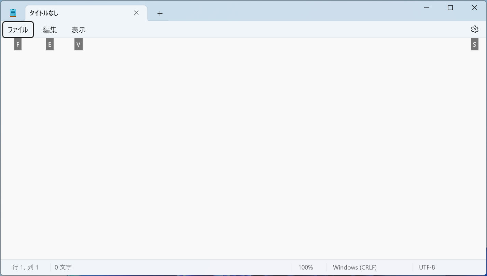

# キーボード

## 入力キー

入力キーには、文字、数字、句読点、記号に加えて、<kbd>Shift</kbd>、<kbd>CapsLock</kbd>、<kbd>Tab</kbd>、<kbd>Enter</kbd>、<kbd>Space</kbd>、<kbd>BackSpace</kbd> も含まれます。

### Shift
<kbd>Shift</kbd> キーを押しながら、アルファベットキーを押すと、大文字が入力されます。また、<kbd>Shift</kbd> キーを押しながら別のキーを押すと、そのキーの上部に記載されている記号が入力されます。

### CapsLock
すべての文字を大文字で入力するには、<kbd>Caps Lock</kbd> + <kbd>Shift</kbd>キーを押します。多くのキーボードでは、大文字モードになると、キーボードの<kbd>Caps Lock</kbd>キーのランプが点灯します。

### Tab
<kbd>Tab</kbd> キーは、カーソルを一定文字数分移動するキーです。

### Enter
<kbd>Enter</kbd> キーは、作業の確定や改行を行うキーです。

### Space
<kbd>Space</kbd> キーは、カーソルを1文字分移動します。また、日本語入力モードで、変換候補を確定するためにも使用します。

### BackSpace
<kbd>BackSpace</kbd> キーを押すと、カーソルの前の文字を削除します。

### Delete
<kbd>Delete</kbd> キーを押すと、カーソルの後の文字を削除します。

### 半角/全角
日本語キーボードには、<kbd>半角/全角</kbd>キーがあります。このキーを押すと、日本語入力モードと英数字入力モードを切り替えることができます。モードを切り替えると、画面の右下のIMEの状態がに「あ」または「A」が表示されます。

### カタカナ/ひらがな
<kbd>カタカナ/ひらがな</kbd>　+ <kbd>Shift</kbd> キーを押すと、カタカナ入力モードに切り替えます。もう一度<kbd>カタカナ/ひらがな</kbd>キーを押すと、ひらがな入力モードに切り替えます。

## コントロールキー

よく使うコントロールキーとして、<kbd>Ctrl</kbd>、<kbd>Alt</kbd>、<kbd>Windows</kbd>、<kbd>Esc</kbd>があります。

### Ctrl

|         ショートカット         | 説明     | English |
| :----------------------------: | :------- | :------ |
| <kbd>Ctrl</kbd> + <kbd>S</kbd> | 保存     | Save    |
| <kbd>Ctrl</kbd> + <kbd>C</kbd> | コピー   | Copy    |
| <kbd>Ctrl</kbd> + <kbd>X</kbd> | 切り取り |         |
| <kbd>Ctrl</kbd> + <kbd>V</kbd> | 貼り付け |         |
| <kbd>Ctrl</kbd> + <kbd>Z</kbd> | 元に戻す |         |
| <kbd>Ctrl</kbd> + <kbd>A</kbd> | 全選択   | All     |
| <kbd>Ctrl</kbd> + <kbd>F</kbd> | 検索     | Find    |
 
### Alt

|         ショートカット          | 説明               |
| :-----------------------------: | :----------------- |
| <kbd>Alt</kbd> + <kbd>Tab</kbd> | ウィンドウ切り替え |

<kbd>Alt</kbd> キーのもう一つの使い方は、アクセスキーです。アクセスキーとは、<kbd>Alt</kbd> キーと特定のキーを同時に押すことで、キーボードでアプリを操作する機能です。MS Office、メモ帳などのアプリケーションでは、アクセスキーが使用されています。

メモ帳で<kbd>Alt</kbd>キーを押すと、使用可能なアクセスキーのヒントが表示されます。<kbd>Alt</kbd>とそれを同時に押すと、その機能が実行されます。

- <kbd>Alt</kbd> + <kbd>F</kbd>：ファイル
- <kbd>Alt</kbd> + <kbd>E</kbd>：編集
- <kbd>Alt</kbd> + <kbd>V</kbd>：表示
- <kbd>Alt</kbd> + <kbd>S</kbd>：設定

### Windows

<kbd>Windows</kbd>キー（以下、<kbd>Win</kbd>キー）は、キーボードの左下にあるWindowsロゴのキーです。<kbd>Win</kbd>キーを押すと、スタートメニューが表示されます。

<kbd>Win</kbd>キーと他のキーを組み合わせると、Windowsのショートカットが使用できます。

|          ショートカット          | 説明                 |
| :------------------------------: | :------------------- |
|  <kbd>Win</kbd> + <kbd>W</kbd>   | ウィジェットを開く   |
|  <kbd>Win</kbd> + <kbd>E</kbd>   | エクスプローラを開く |
| <kbd>Win</kbd> + <kbd>Tabs</kbd> | タスクビューを開く   |
|  <kbd>Win</kbd> + <kbd>D</kbd>   | デスクトップを表示   |

### Esc（エスケープ）

<kbd>Esc</kbd>キーは現在の操作をキャンセルするために使用します。

### F1～F12

<kbd>F1</kbd>～<kbd>F12</kbd>キーは、様々な機能を持っています。また、キーボードによって、<kbd>F1</kbd>～<kbd>F12</kbd>キーに割り当てられた機能が異なります。

### Fn
<kbd>F1</kbd>～<kbd>F12</kbd>キーには、マークが付いている場合は、<kbd>Fn</kbd>キーを押しながら<kbd>F1</kbd>～<kbd>F12</kbd>キーを押すと、機能の切り替えができます。

### Copilotキー
<kbd>Copilot</kbd>キーは、Microsoft Copilotのショートカットキーです。

## 練習（2分間）

1. メモ帳を開いて、全角モードと半角モードで、それぞれ、カンマ、ピリオド、スペースと数字を入力し、その違いを確認してみよう。