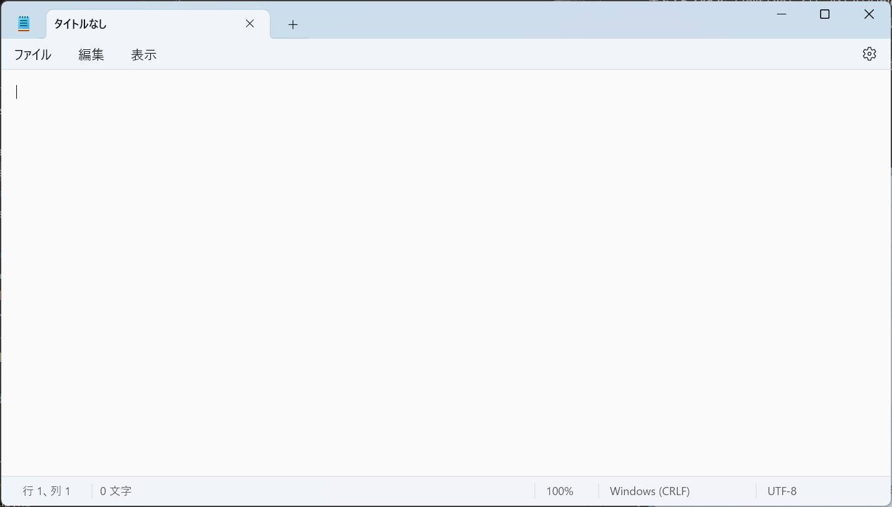

# メモ帳

テキストファイルを編集するためのソフトウェアは、**テキストエディタ**（Text Editor）と呼ばれます。Microsoft Windowsに標準で付属しているテキストエディタは、**メモ帳**（Notepad）です。

メモ帳を起動するには、検索ボックスに「メモ帳」や「Notepad」と入力して、メモ帳を選択します。

<!--  -->

メモ帳の起動したら、次のような画面が表示されます。点滅している縦棒が、カーソルです。カーソルの位置に文字が入力されます。

:::{figure-md} notepad


メモ帳の基本画面
:::

## 設定
歯車のアイコン⚙️をクリックして、フォントや文字列の折り返しなどの設定を変更できます。デフォルトのフォントでは、ファミリは「MS ゴシック」、スタイルは「標準」、サイズは「11」です。

## 保存
新しいファイルを保存するには、「ファイル」メニューから「名前を付けて保存」を選択します。「名前を付けて保存」の画面では、保存場所、ファイル名、ファイルの種類を設定できます。デフォルトのファイルの種類は、「テキスト ドキュメント (*.txt)」です。必要に応じて、保存場所とファイル名を設定して、「保存」ボタンをクリックします。

## 名前を付けて保存と保存
「ファイル」メニューでは「名前を付けて保存」と「保存」の2つの保存方法があります。

**名前を付けて保存**は、新しい名称のファイルとして保存します。既存のファイルをを編集して名前を付けて保存すると、編集前のファイルは消さずに、新しいファイルとして保存されます。**保存**は、既に保存したファイルを上書き保存します。新しいファイルの場合は、名前を付けて保存と同じ動作になります。

## ショートカットキー
| ショートカット                 | 説明     |
| ------------------------------ | -------- |
| <kbd>Ctrl</kbd> + <kbd>S</kbd> | 保存     |
| <kbd>Ctrl</kbd> + <kbd>C</kbd> | コピー   |
| <kbd>Ctrl</kbd> + <kbd>X</kbd> | 切り取り |
| <kbd>Ctrl</kbd> + <kbd>V</kbd> | 貼り付け |

## 課題

1. メモ帳のフォントとサイズを好きなものに変更してみよう。
2. メモ帳を使って、以下の文字列を入力し、「my_first_text.txt」として保存しよう。
   ```
   Hello, World!
   こんにちは、世界！
   ```
3. 保存したファイルを再度開いて、ショートカットキーでコピー、切り取り、貼り付けを試してみよう。
4. ショートカットキーで保存してみよう。
5. 以下の文字列を入力し、「my_web_page.html」として保存しよう。
   ```html
   <!DOCTYPE html>
   <html>
   <head>
     <title>My Web Page</title>
   </head>
   <body>
     <h1>This is a heading</h1>
       <p>This is a paragraph.</p>
   </body>
   </html>
   ```
