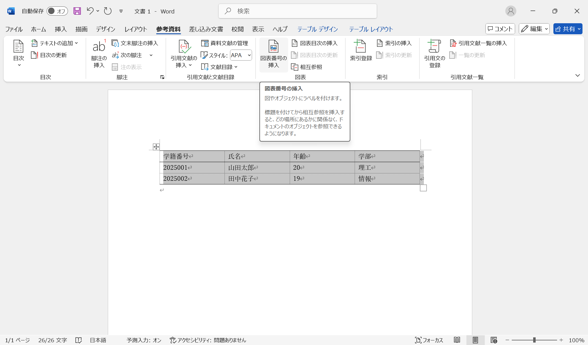
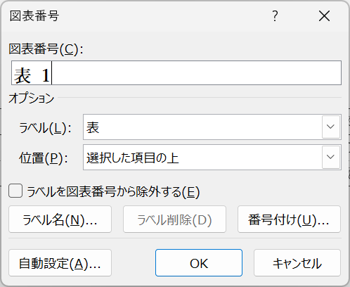
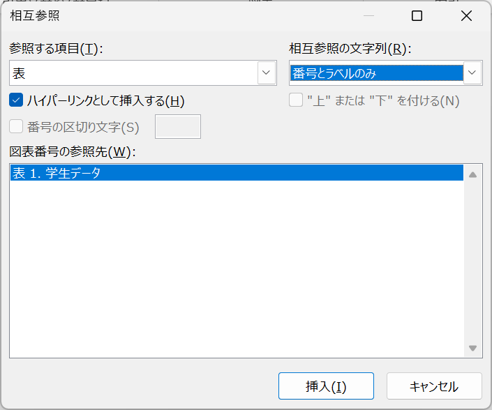

# 文書の編集

## 文字入力

ワードに日本語の文字を入力するには、メモ帳などと同様に、日本語IMEを利用します。

ここでは、ワードの「貼り付け」機能について、説明します。ウェブページなどからテキストをコピーして、ワードの文書に貼り付ける方法を紹介します。以下のテキストは、Wikipediaの「[Microsoft Word](https://ja.wikipedia.org/wiki/Microsoft_Word)」のページにある文章です。テキストだけでなく、太字やリンクも含まれています。

---
**Microsoft Word**（マイクロソフト ワード）は、
[マイクロソフト](https://ja.wikipedia.org/wiki/%E3%83%9E%E3%82%A4%E3%82%AF%E3%83%AD%E3%82%BD%E3%83%95%E3%83%88)
がWindows、Android、macOSおよびiOS向けに販売している
[文書作成ソフトウェア](https://ja.wikipedia.org/wiki/%E3%83%AF%E3%83%BC%E3%83%97%E3%83%AD%E3%82%BD%E3%83%95%E3%83%88)。

---

この内容を以下の手順でワードの文書に貼り付けてみましょう。

1. マウスで、上記のテキストを選択し、右クリックして「コピー」を選択します。
2. ワードの文書に移動し、適当な位置で右クリックします。
3. 「貼り付けのオプション」では、「元の書式を保持」、「書式を結合」、「テキストのみ保持」の三つのオプションが表示されます。それぞれのオプションを選択して、その違いを確認してみましょう。

「元の書式を保持」、「書式を結合」、「テキストのみ保持」の違いについて説明します。

- **元の書式を保持**：コピー元の書式をそのまま保持して貼り付けます。
- **書式を結合**：コピー元の書式と、ワードの書式を結合して貼り付けます。
- **テキストのみ保持**：テキストのみを貼り付けます。

文書の書式が崩れないように、一般的には「テキストのみ保持」を選択します。

## 数式の入力

まずは、数式を入力する前に、**半角モード**に切り替えていることを確認しましょう。

数式を入力するには、「挿入」タブの「記号と特殊文字」グループから、「数式」を選択します。すると、「数式」タブが表示されます。

:::{figure-md} formula

数式の入力
:::

「数式」タブには「ツール」、「変換」、「記号と特殊文字」、「構造」のグループがあります。「記号と特殊文字」と「構造」グループを用いて、直感的に数式を入力することができます。

また、「変換」モードが「Unicode」になっています。これは、数式を入力する際に、**UnicodeMath**形式で入力することを意味します。他には「LaTex」がありますが、ここではデフォルトの「Unicode」について説明します。

:::{note}
$\TeX$（テフ）は、文書整形プログラムの一つです。$\TeX$にマクロパッケージを追加したものが$\LaTeX$（ラテフ）です。
理系の学術論文や書籍を作成するために、$\LaTeX$が広く利用されています。
:::

### UnicodeMath形式

ここでは、例を使って、UnicodeMath形式で数式を入力する方法を説明します。日本語システムでは、「\」を「￥」キーで入力します。「a^2 <kbd>Space</kbd>」は、a^2 を入力し、<kbd>Space</kbd>キーを押すことを意味します。以下の表を参考に、数式を入力してみましょう。

|            UnicodeMath             |          表示           | 説明   |
| :--------------------------------: | :---------------------: | :----- |
|        a^2 <kbd>Space</kbd>        |          $a^2$          | 二乗和 |
|        x_1 <kbd>Space</kbd>        |          $x_1$          | 添字   |
|     \sqrt(a) <kbd>Space</kbd>      |       $\sqrt{a}$        | 平方根 |
|      a/(b+c) <kbd>Space</kbd>      |     $\frac{a}{b+c}$     | 分数   |
|      (a+b/c) <kbd>Space</kbd>      |    $(a+\frac{b}{c})$    | 括弧   |
|      {a+b/c} <kbd>Space</kbd>      |   $\{a+\frac{b}{c}\}$   | 波括弧 |
|   \overbar(abc) <kbd>Space</kbd>   |    $\overline{abc}$     | 上線   |
| lim_(n->\infty) <kbd>Space</kbd> n | $\lim_{n \to \infty} n$ | 極限   |
|  \sum_(i=1)^n <kbd>Space</kbd> i   |    $\sum_{i=1}^n i$     | 総和   |
|       sin <kbd>Space</kbd> x       |        $\sin x$         | 正弦   |
|       cos <kbd>Space</kbd> x       |        $\cos x$         | 余弦   |
|       tan <kbd>Space</kbd> x       |        $\tan x$         | 正接   |
|      \alpha <kbd>Space</kbd>       |        $\alpha$         | Alpha  |
|       \beta <kbd>Space</kbd>       |         $\beta$         | Beta   |

### 式番号

式番号をつけるには、入力した数式の最後に`#(番号)`と入力して、<kbd>Enter</kbd>キーを押します。

例えば、`y=ax+b#(1)`と入力し、<kbd>Enter</kbd>キーを押すと、式番号`(1)`が式の右側に表示されます。

:::{figure-md} formula-number

式番号の挿入
:::

## 画像の挿入

画像を挿入するには、「挿入」タブの「図」グループから、「画像」を選択します。すると、「画像の挿入元」が表示されます。

:::{figure-md} image-source

画像の挿入元の選択
:::

- **このデバイス...**：PC内の画像ファイルを選択して挿入します。
- **ストック画像...**：Microsoftの提供する画像を選択して挿入します。アイコン、マンガ、イラストなどがあります。
- **オンライン画像...**：インターネット上の画像を挿入します。

ここでは、「このデバイス...」を使って、以下の画像を挿入してみます。まず、この画像を右クリックして、「名前を付けて画像を保存」で、PC内に保存します。デフォルトでは、画像は「ダウンロード」フォルダに「example.png」という名前で保存されます。

:::{figure-md} image-example

画像の例
:::

ワードの画面に戻り、以下の手順で画像を挿入します。

1. 画像を挿入したい位置にカーソルを置きます。
2. 「挿入」タブの「図」グループから、「画像」を選択します。
3. 「このデバイス...」を選択し、「図の挿入」ダイアログが表示されます。
4. 保存した画像ファイルを選択し、「挿入」をクリックします。
5. 画像がカーソルの位置に挿入されます。

画像が挿入されると、「図の形式」タブが表示されます。表示されていない場合は、画像を左クリックすると表示されます。「図の形式」では、画像のスタイルやサイズなどを設定できます。

:::{figure-md} image-format

「図の形式」タブ
:::

## 表の作成

表を挿入するには、「挿入」タブの「表」グループから、「表」を選択します。すると、表の行数と列数を選択できます。ここでは、3行4列の表を挿入してみます。

:::{figure-md} table-insert

表の挿入
:::

表が挿入されると、「テーブル デザイン」と「テーブル レイアウト」タブが表示されます。必要に応じて、これらのタブを使って、表のスタイルやレイアウトを設定できます。

:::{figure-md} table-design

「テーブル デザイン」と「テーブル レイアウト」タブ
:::

次に、表の中にテキストを入力します。<kbd>Tab</kbd>キーやマウスで、セルの移動ができます。また、学籍番号と年齢は半角で入力することを忘れないようにしましょう。

| 学籍番号 |   氏名   | 年齢  | 学部  |
| :------: | :------: | :---: | :---: |
| 2025001  | 山田太郎 |  20   | 理工  |
| 2025002  | 田中花子 |  19   | 情報  |

:::{figure-md} table-input

表の入力
:::

表の罫線（けいせん）を必要に応じて変更することができます。

表の罫線を変更するには、テーブルを選択した状態で、「テーブル デザイン」タブの「罫線」を選択します。

:::{figure-md} table-line

罫線の変更
:::

論文やレポートを作成する際には、一般的に表の最上行、最下行、見出し行に罫線を引きます。

:::{figure-md} table-line-ex

表の罫線の例
:::

## 図表番号の挿入

論文やレポートでは、図や表に番号を付けることが必要です。ワードでは、図表番号を自動的に挿入・更新することができます。以下の手順で、図表番号を挿入してみましょう。

対象となる図表を選択した状態で、「参考資料」タブの「図表」グループから、「図表番号の挿入」を選択します。

:::{figure-md} number-1

対象の図表を選択
:::

次に、「図表番号」ダイアログが表示されます。「ラベル」から「図」または「表」を選択し、「OK」をクリックします。

:::{figure-md} number-2

「図表番号」ダイアログ
:::

図番号は図の下に、表番号は表の上に挿入されます。番号の後ろに、図表の内容を説明するための**キャプション**を入力します。マウスで図表番号とキャプションを選択すると、番号の部分が濃い灰色で表示されます。これが、図表の追加や削除を行ったときに、自動的に更新される部分です。

:::{figure-md} number-3

「図表番号の挿入」ダイアログ
:::

:::{note}
式番号もこの方法で挿入できます。
:::

:::{note}
図表番号とキャプションの書式は、ワードの「スタイル」機能を使って変更できます。
:::

## 相互参照

論文やレポートに図表を挿入した場合、本文中で図表を参照することが必要です。ワードでは、「相互参照」機能を使って、図表を参照することができます。以下の手順で、相互参照を挿入してみましょう。

図表を参照したい位置にカーソルを置きます。「参考資料」タブの「図表」グループから、「相互参照」を選択します。

:::{figure-md} reference-1

「相互参照」の選択
:::

「相互参照」ダイアログが表示されたら、「参照する項目」から「図」または「表」を選択し、「相互参照の文字列」を「番号トラベルのみ」に設定します。次に、挿入したい図表を選択し、「挿入」をクリックします。

:::{figure-md} reference-2

「相互参照」ダイアログ
:::

すると、カーソルの位置に図表の番号が挿入されます。

:::{figure-md} reference-3

図表番号の参照
:::