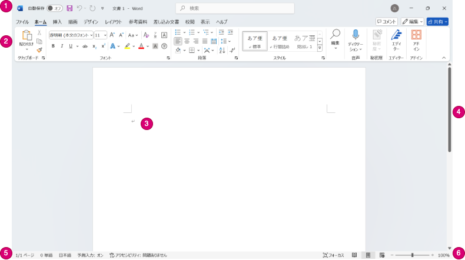
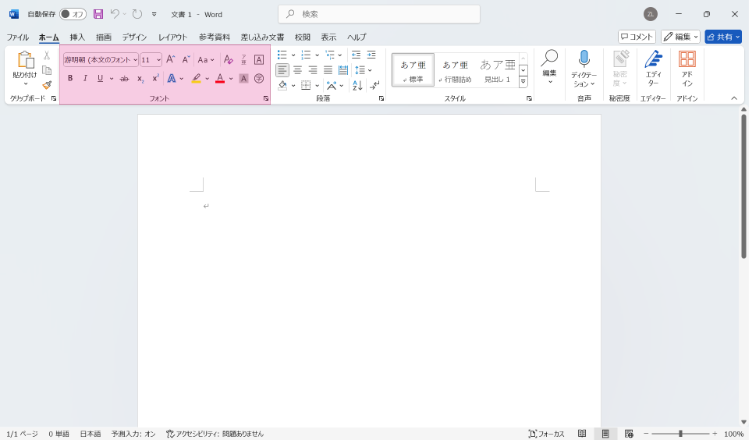

# 新規Word文書の作成

新規Word文書を作成するには、検索ボックスに「Word」と入力して、Wordを選択します。

Wordを起動したら、次のような画面が表示されます。ここには、「白紙の文書」、「カレンダー」などのテンプレートが用意されています。その下にある「その他のテンプレート」を選択すると、「請求書」、「賞状」などさらに多くのテンプレートが用意されています。

:::{figure-md} word_start


Wordの起動画面
:::

ここでは、「白紙の文書」を選択して、新規Word文書を作成します。

## Wordの画面構成

Wordの起動画面で「白紙の文書」を選択すると、以下のような画面が表示されます。

:::{figure-md} word_blank


白紙の文書
:::

Wordの画面は、以下のように構成されています。
1. クイックアクセスツールバー（Quick Access Toolbar）：よく使う機能のアイコンが表示されている
2. リボン（Ribbon）
   - タブ（Tab）：ファイル、ホーム、描画、デザイン、レイアウト、参考資料、差し込み文書、校閲、表示、ヘルプ
   - グループ（Group）：タブ内の機能をまとめたもの。例えば、「ホーム」タブには、フォント、段落、スタイルなどのグループがある。
   - コマンド（Command）：グループ内の機能を実行するためのボタン。例えば、「ホーム」タブの「フォント」グループには、フォントの種類、サイズ、色などのコマンドがある。
3. ドキュメントエリア（Document Area）：文書の編集エリア
4. スクロールバー（Scrollbar）：ドキュメントエリアのスクロール
5. ステータスバー（Status Bar）：ページ数、単語数などの情報
6. ズームスライダー（Zoom Slider）：「＋」、「－」でズームイン、ズームアウト

## 基本的な操作

「ホーム」タブには、「フォント」グループを用いて、文字の装飾を行うことができます。

:::{figure-md} word_blank


「フォント」グループ
:::

以下の内容をワードの文書に入力して、文字の装飾を試してみましょう。

```
遊明朝　サイズ：12　太字
遊明朝 Light　サイズ：11　斜体　下線
メイリオ　サイズ：16　太字　下線　取り消し線　
遊明朝　サイズ：12　フォントの色：赤
遊明朝　サイズ：12　蛍光ペンの色：黄色
遊明朝　サイズ：12　文字の網かけ
遊明朝　サイズ：12　ルビ：情報（じょうほう）
```

## 文書の保存・印刷

### 文書の保存

Word文書を「ドキュメント」に保存するには、以下の手順を行います。

1. 「ファイル」タブをクリックします。
2. 「名前を付けて保存」を選択します。
3. 「ドキュメント」が選択されていることを確認します。
4. ファイル名を入力し、「保存」をクリックします。

### 文書の印刷

Word文書をPDF形式で印刷するには、以下の手順を行います。

1. 「ファイル」タブをクリックします。
2. 「印刷」を選択します。
3. プリンターの設定では、Microsoft Print to PDFが選択されていることを確認します。
4. 「印刷」をクリックします。