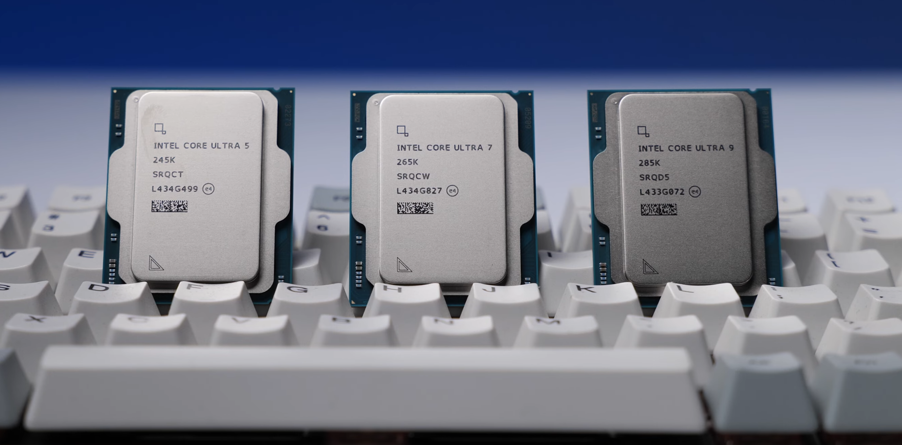

# コンピュータ・アーキテクチャ

<!-- ## パソナルコンピュータの構成要素 -->

<!-- Consider the following specification for a laptop computer that might  appear in a typical advertisement. -->
<!-- 
以下は、一般的な広告に掲載される可能性のあるノートパソコンの仕様の一例である．

> プロセッサー : AMD Ryzen™ 7 7735HS (3.20 GHz 最大 4.75 GHz)
- 初期導入OS : Windows 11 Home 64bit   
- 導入OS言語 : Windows 11 Home 64bit - 日本語版   
- DIMMメモリー : 32 GB DDR5-4800MHz (SODIMM) - (2 x 16 GB)   
- 1stストレージ : 256 GB SSD M.2 2242 PCIe-NVMe Gen4 TLC OPAL対応   
- 2ndストレージ : なし   
- ディスプレイ : 14" WUXGA液晶 (1920 x 1200) IPS, 光沢なし, マルチタッチ非対応, 45%NTSC, 300 nit, 60Hz   
- グラフィックカード : 内蔵グラフィックス   
- 内蔵カメラ : 720p HDカメラ、マイク   
- 本体カラー : グラファイトブラック   
- カバー素材 : アルミニウム   
- 無線LANアダプター : Wi-Fi 6対応 (IEEE 802.11ax/ac/a/b/g/n準拠) 2x2 & Bluetooth® (RealTek 8852BE)
- 1st イーサネット : 有線イーサネット
- 指紋センサー : 指紋センサーなし
- キーボード : ブラック - 日本語
- バッテリー : 3 セル リチウムイオンポリマーバッテリー 47 Wh
- 電源アダプター : 65W ACアダプター (2ピン) USB Type-C

- Processor: Intel® Core™ Ultra 7 268V vPro® Processor (LPE-cores up to 3.70 GHz P-cores up to 5.00 GHz / 32 GB MOP)
- Operating System: Windows 11 Pro 64
- Graphic Card: Integrated Intel® Arc™ Graphics 140V
- Memory: 32 GB LPDDR5X-8533MHz (Memory on Package)
- Storage: 1 TB SSD M.2 2242 PCIe Gen4 TLC Opal
- Display: 14" 2.8K (2880 x 1800), OLED, Anti-Glare/Anti-Reflection/Anti-Smudge, Touch, HDR 500 True Black, 100%DCI-P3, 500 nits, VRR 30-120Hz, Low Blue Light
- Camera: 8MP RGB+IR with E-Shutter, Human Presence Detection
- Fingerprint Reader: Fingerprint Reader
- Keyboard: Backlit, Black/Grey - English (US)
- WIFI: Intel® Wi-Fi 7 BE201 2x2 BE vPro® & Bluetooth® 5.4
- Warranty: One Year Onsite
- Color: Thunder Grey
- Operating System Language: US:United States English,UK:United Kingdom English

ここでは，この仕様に基づいて，コンピュータに関する基本的な概念を説明する．

この仕様によると，このコンピュータは，AMD Ryzen™ 7 7735HS というプロセッサーを搭載している．このプロセッサーの平均クロック速度は3.20 GHz（ギガヘルツ）で，最大クロック速度は4.75 GHzである．クロック速度は，プロセッサーが1秒間に何回の動作を行うかを示す．プロセッサーのクロック速度が高いほど，コンピュータの処理速度が速くなる．Hz（ヘルツ）は，周波数の基本単位で，一秒間に一回の振動数を表わす．例えば，1ヘルツは，1秒間に1回の周波数を表わす．GHzのG（ギガ）は，$10^9$（10億）を表わすため，1 GHzは，1秒間に10億回の周波数を表わす．

GB（ギガバイト）は，$10^9$倍のバイトを表わす．**バイト**（byte）は，情報量の単位で，1バイトは，8ビット（bit）からなる．1ビットは，情報の最小単位で，0または1の値を取る． -->

現在のほとんどのコンピューターは，**ノイマン型**（von Neumann architecture）と呼ばれるアーキテクチャに基づいて設計されている．ノイマン型コンピューターは，演算装置，制御装置，記憶装置，入力装置，出力装置から構成される．これらの装置は，日本では**コンピューターの5大装置**とも呼ばれる．次の図では，ノイマン型を示している．

:::{figure-md} VonNeumann

ノイマン型
:::

ノイマン型では，プログラムをハードウェアから独立して，データと同様に扱う．このような考え方を**プログラム内蔵方式**（stored-program computer）と呼ぶ．

数学者ジョン・フォン・ノイマン（John von Neumann）が書かれた報告書「First Draft of a Report on the EDVAC」（1945年）で最初にこのアーキテクチャを公開した．

## 演算装置と制御装置

**演算装置**は，算術論理演算装置（arithmetic/logic unit, ALU）とも呼ばれ，算術演算や論理演算を行う装置である．**制御装置**（control unit, CU）は，プログラムの命令を解読して他の装置を制御する．演算装置と制御装置を統合したものを**中央処理装置**（central processing unit, CPU）と呼ぶ．CPUは，コンピューターの中心的な役割を果たし，コンピューターの頭脳とも呼ばれる．以下の図は，2024年10月から発売されているIntel Core UltraシリーズのCPUである．

:::{figure-md} intel_ultra

Intel Core Ultra © [ZMASLO](https://www.youtube.com/@ZMASLO)
:::

:::{note}
CPUが命令を実行するサイクルを**命令サイクル**（instruction cycle, fetch-execute cycle）と呼ぶ．

CPUがこのサイクルを繰り返すことで，プログラムが実行される．命令サイクルは，次の3つのステップからなる．

1. **フェッチ（Fetch）**：次の命令を取得する．
2. **デコード（Decode）**：命令を解読する．
3. **実行（Execute）**：命令を実行する．

> Sometimes I think the only universal in the computing field is the fetch-execute cycle.
> 
> -- Epigrams on Programming, Alan J. Perlis

**練習問題**：
命令サイクルにおいて，演算装置と制御装置はそれぞれどのような役割を果たすかを考えてみよう．
:::

現在のCPUは、演算装置、制御装置、**レジスタ**（register）と呼ばれる高速な記憶装置を持つ．レジスタは、CPU内部でデータを一時的に保存するための記憶装置である．レジスタは、CPUが直接アクセスできるため、主記憶装置よりも高速にデータを読み書きできる．CPUは、**バス**（bus）と呼ばれる回線を通じて、記憶装置とデータをやり取りする．

:::{figure-md} cpu_registers

CPUと主記憶装置
:::

## 記憶装置

**記憶装置**は，データやプログラムを保存するための装置である．現在のほとんどのコンピューターには，主記憶装置と補助記憶装置がある．

**主記憶装置**（main memory）は，CPUが直接アクセスできる記憶装置である．主記憶装置はデータやプログラムを一時的に保存する．電源を切るとデータが消える**揮発性**（volatile）を持つ．

:::{figure-md} main_memory

パソコン用の主記憶装置 © [Evan-Amos](https://commons.wikimedia.org/wiki/User:Evan-Amos), [CC BY-SA 3.0](https://creativecommons.org/licenses/by-sa/3.0/deed.en)
:::

**補助記憶装置**（secondary storage）は，データやプログラムを永続的に保存するための装置である．電源を切ってもデータが消えない**不揮発性**（non-volatile）を持つ．補助記憶装置は，HDD（Hard Disk Drive），SSD（Solid State Drive），USBメモリ，SDカードなどがある．

## 入力装置と出力装置

**入力装置**（input unit）は，コンピューターにデータやプログラムを入力するための装置である．キーボード，マウス，タッチパッドなどがある．

**出力装置**（output unit）は，コンピューターからデータ処理の結果を出力するための装置である．ディスプレイ，プリンタ，スピーカーなどがある．

コンピューターの入力装置と出力装置を合わせて**入出力装置**（I/O device）と呼ぶ．**インタフェース**（interface）は，コンピューター本体と周辺機器との間でデータをやり取りするための方式である．コンピューター本体に周辺装置との入出力のため設けられた接続端子を**ポート**（port）と呼ぶ．次の図は，ThinkPad L13 Gen 4 AMDのポートを示している．

:::{figure-md} thinkpad_ports

ThinkPad L13 Gen 4 AMD © [Lenovo](https://www.lenovo.com/jp/ja/p/laptops/thinkpad/thinkpad-l-series/thinkpad-l13-gen-4-13-inch-amd/21fn001fjp)
:::

1. HDMI
2. USB 3.2 Gen1
3. USB 3.2 Gen1 Type-C
4. セキュリティスロット
5. SIMカードスロット
6. USB 3.2 Gen2 Type-C
7. USB 3.2 Gen1
8. マイクロホン/ヘッドホン・コンボ・ジャック
9. スマートカードスロット

**HDMI**は，ディスプレイとパソコン，ゲーム機などを接続するためのインターフェースである．

**USB**は，パソコンと周辺機器を接続するための汎用インターフェース仕様の一つである．マウス，キーボードなどの接続に使われる．現在多くのスマホー，ゲーム機．パソコンに搭載されているのが**USB Type-C**である．USB Type-Cの特徴は，コネクタ部分に上下の区別がないことである．さらに，USB Type-Cは，電源供給やデータ転送，映像出力などが可能である．

## 用語

| 略称 | 意味                    | 日本語訳                 |
| ---- | ----------------------- | ------------------------ |
| CPU  | Central Processing Unit | 中央処理装置             |
| ALU  | Arithmetic/Logic Unit   | 演算論理装置             |
| CU   | Control Unit            | 制御装置                 |
| OS   | Operating System        | オペレーティングシステム |
| PC   | Personal Computer       | パーソナルコンピュータ   |

## 練習問題

- google classroom

<!-- 

### 選択問題
正しいものを選びなさい．

1. 次のうち、コンピューターを構成する物理的な装置を指す用語はどれか？
   1. ハードウェア
   2. ソフトウェア
   3. アプリケーション
   4. ファームウェア

2. 現在のほとんどのコンピューターが採用しているアーキテクチャは？
   1. ノイマン型
   2. チューリング型
   3. ハーバード型

3. コンピューターの五大装置に含まれないものはどれか？
   1. 演算装置
   2. 制御装置
   3. 通信装置
   4. 入力装置

4. 演算装置（ALU）の主な役割は何か？
   1. 命令の解読
   2. データの保存
   3. 算術演算・論理演算
   4. データの入力

5. 中央処理装置（CPU）に含まれる装置はどれか？
   1. 記憶装置
   2. 演算装置と制御装置
   3. 出力装置
   4. 補助記憶装置

6. 主記憶装置の特徴として正しいものはどれか？
   1. 電源を切るとデータが消える
   2. データを永久に保存できる
   3. USBメモリのような外部記憶装置である
   4. CPUが直接アクセスできない

7. HDDやSSDは何に分類されるか？
   1. 主記憶装置
   2. 補助記憶装置
   3. 入力装置
   4. 出力装置

8.  USB Type-Cの特徴として正しいものはどれか？
   1. コネクタに上下の区別がない
   2. データ転送はできるが電源供給はできない
   3. 映像出力はできない
   4. すべてのパソコンに搭載されている

### 正誤問題
次の文が正しい場合は○、誤っている場合は×を選びなさい。

1. CPUはコンピューターの演算処理を行うが、制御は行わない。
2. ノイマン型コンピューターではプログラムとデータは別々に保存される。
3. システムソフトウェアにはOSが含まれる。
4. キーボードは出力装置の一つである。
5. HDMIは映像を出力するためのインタフェースである。
6. ソフトウェアには物理的な形がある。
7. OSがないとコンピューターは動作できない。 -->

<!-- 
### 記述問題

ノイマン型コンピューターの5大装置をすべて答えなさい。

プログラム内蔵方式とは何か説明しなさい。

命令サイクルの3つのステップを順番に書きなさい。

主記憶装置と補助記憶装置の違いを簡潔に説明しなさい。

システムソフトウェアとアプリケーションソフトウェアの違いを説明しなさい。

コンピューターの入力装置と出力装置をそれぞれ2つずつ挙げなさい。

CPUの役割について簡潔に説明しなさい。

HDMIポートの用途を説明しなさい。

USBの用途を2つ挙げなさい。

OS（オペレーティングシステム）の主な役割を説明しなさい。 -->

<!-- ## 練習問題

1. ノイマン型コンピューターの構成要素を説明しなさい．
2. 主記憶装置と補助記憶装置の違いを説明しなさい．
3. タッチパネルは5大装置のどこに分類されるかを説明しなさい．
4. システムソフトウェアとアプリケーションソフトウェアの違いを説明しなさい．
5. 所有しているパソコンのポートを調べ，それぞれのポートの用途を説明しなさい． -->